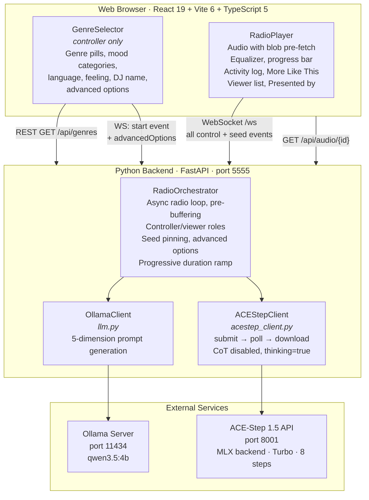
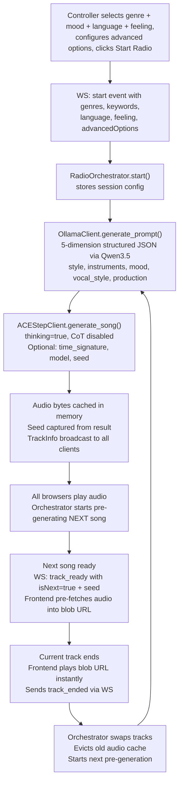

# Generative Radio — Build Specification (v2)

> **Snapshot date:** 2026-02-25
> **Supersedes:** `BUILD_SPEC_V1.md` (v1 spec)
>
> This document describes the current state of the codebase — architecture, runtime behaviour, protocols, and implementation details — as a single reference for contributors and AI coding assistants.

---

## Table of Contents

1. [Project Overview](#1-project-overview)
2. [Architecture](#2-architecture)
3. [Tech Stack & Dependencies](#3-tech-stack--dependencies)
4. [Project Structure](#4-project-structure)
5. [Prerequisites & Setup](#5-prerequisites--setup)
6. [Runtime Configuration](#6-runtime-configuration)
7. [Backend Implementation](#7-backend-implementation)
8. [Frontend Implementation](#8-frontend-implementation)
9. [WebSocket Protocol](#9-websocket-protocol)
10. [Multi-Listener: Controller / Viewer Model](#10-multi-listener-controller--viewer-model)
11. [Audio Pipeline & Pre-fetching](#11-audio-pipeline--pre-fetching)
12. [Language & Instrumental Support](#12-language--instrumental-support)
13. [Dimension-Based LLM Prompting](#13-dimension-based-llm-prompting)
14. [ACE-Step 1.5 Integration](#14-ace-step-15-integration)
15. [Advanced Options](#15-advanced-options)
16. [Seed Pinning ("More Like This")](#16-seed-pinning-more-like-this)
17. [Launch Scripts](#17-launch-scripts)
18. [Memory, Duration & Performance](#18-memory-duration--performance)
19. [Remote Access (Cloudflare Tunnel)](#19-remote-access-cloudflare-tunnel)
20. [Debugging & Logging](#20-debugging--logging)
21. [Design System](#21-design-system)

---

## 1. Project Overview

**Generative Radio** is a fully local, offline AI radio web app. Users select a genre, mood keywords, vocal language, and optional personal feeling — then the app generates and plays an endless stream of original AI-composed songs.

### Core Loop

1. User picks **one genre** and optional **mood keywords** (organized by category)
2. User selects a **vocal language** (11 languages or instrumental)
3. Optionally types a **free-text feeling** ("Late night coding session, need focus")
4. Optionally configures **advanced options** (time signature, inference steps, DiT model variant)
5. A local LLM (Ollama + Qwen3.5) generates a **dimension-based song prompt** (style, instruments, mood, vocal_style, production)
6. ACE-Step 1.5 generates a full MP3 with semantic audio codes for melodic structure
7. The song plays in the browser with a live activity log
8. While it plays, the **next song is pre-generated** in the background
9. The frontend pre-fetches audio bytes into a blob URL for zero-latency transition
10. Cycle repeats until the controller stops the session

**Everything runs locally.** No cloud APIs required after initial setup.

### Multi-Listener Model

Multiple browser clients can connect simultaneously. The first connection becomes the **controller** (full UI: genre selection, start/stop/skip, "More Like This" seed pinning). All subsequent connections are **viewers** (read-only player, real-time audio sync). When the controller disconnects, the next viewer is promoted.

---

## 2. Architecture



### Data Flow (One Song Cycle)



---

## 3. Tech Stack & Dependencies

| Component | Technology | Version / Notes |
|---|---|---|
| **Frontend** | React + Vite + TypeScript | React 19, Vite 6, TS 5.7+ |
| **Fonts** | Bebas Neue (display) + Space Grotesk (body) | Google Fonts |
| **Backend** | Python FastAPI | Python 3.11–3.12, FastAPI 0.115+ |
| **LLM** | Ollama + qwen3.5:4b | Always 4b (~2.5 GB); sufficient for prompt generation |
| **Music Gen** | ACE-Step 1.5 | MLX backend, turbo model, 8 inference steps (configurable) |
| **Package Mgmt** | uv (Python / ACE-Step), pip (backend venv), npm (JS) | |
| **Audio Format** | MP3 | Generated by ACE-Step, served via chunked streaming |
| **Tunnel** | cloudflared (optional) | Named tunnel (fixed domain) or Quick Tunnel (random URL) |

### Python Dependencies (`backend/requirements.txt`)

```
fastapi>=0.115.0
uvicorn[standard]>=0.32.0
ollama>=0.5.1
httpx>=0.27.0
pydantic>=2.0.0
psutil>=6.0.0
```

### Node Dependencies (`frontend/package.json`)

```json
{
  "dependencies": {
    "react": "^19.0.0",
    "react-dom": "^19.0.0"
  },
  "devDependencies": {
    "@types/react": "^19.0.0",
    "@types/react-dom": "^19.0.0",
    "@vitejs/plugin-react": "^4.0.0",
    "typescript": "^5.7.0",
    "vite": "^6.0.0"
  }
}
```

---

## 4. Project Structure

```
generative-radio/
├── backend/
│   ├── main.py                # FastAPI app: REST endpoints, WebSocket handler, CORS, lifespan
│   ├── radio.py               # RadioOrchestrator: async loop, pre-buffering, roles, seed pinning
│   ├── llm.py                 # OllamaClient: 5-dimension prompt generation with feeling injection
│   ├── acestep_client.py      # ACEStepClient: advanced options, seed, CoT-disabled pipeline
│   ├── models.py              # Pydantic models: SongPrompt (5 dimensions), TrackInfo, WSMessage
│   ├── genres.py              # 24 genres, 29 keywords (4 categories), 12 languages
│   ├── config.py              # Memory detection, model selection, progressive duration, mem_snapshot()
│   └── requirements.txt
├── frontend/
│   ├── index.html             # HTML entry + Google Fonts (Bebas Neue, Space Grotesk)
│   ├── package.json
│   ├── tsconfig.json
│   ├── tsconfig.app.json
│   ├── tsconfig.node.json
│   ├── vite.config.ts         # Proxy /api→:5555, /ws→ws://:5555, allowedHosts
│   └── src/
│       ├── main.tsx
│       ├── App.tsx            # Role-aware routing, session info, DJ name, moreLikeThis
│       ├── App.css            # Full stylesheet: fonts, genre pills, mood groups, advanced options
│       ├── types.ts           # Track, Genre, Keyword, AdvancedOptions, SessionInfo, seed in TrackReadyData
│       ├── components/
│       │   ├── GenreSelector.tsx   # Genre pills, grouped moods, feeling, DJ name, advanced options
│       │   ├── RadioPlayer.tsx     # Player, activity log, More Like This, Presented by
│       │   └── StatusBar.tsx       # Status dot + message + spinner + listener count
│       └── hooks/
│           └── useRadio.ts        # WS lifecycle, blob pre-fetch, seed state, moreLikeThis, advancedOptions
├── scripts/
│   ├── setup.sh               # One-time: Homebrew, Ollama, LLM models, ACE-Step, venv, npm install
│   └── start.sh               # Launch: Ollama, ACE-Step, backend, frontend, cloudflared (named or quick)
├── docs/
│   ├── acestep-enhanced-inputs-plan.md
│   ├── acestep-thinking-mode-analysis.md
│   ├── acestep-memory-vs-duration.md
│   ├── cloudflare-named-tunnel-setup.md
│   ├── genre-mood-expansion-plan.md
│   ├── llm-prompt-improvement-plan.md
│   ├── multi-listener-controller-viewer.md
│   └── multiple-github-accounts-mac.md
├── BUILD_SPEC.md              # This file
├── BUILD_SPEC_V1.md           # Previous spec
├── BUILD_SPEC_V0.md           # Original spec
├── README.md
├── research-local-ai-music-generation-mac.md
└── .gitignore
```

---

## 5. Prerequisites & Setup

### Hardware Requirements

- Mac with Apple Silicon (M1/M2/M3/M4)
- macOS 14+
- 16 GB+ unified memory (24 GB+ recommended, 64 GB for production)
- 50 GB+ free SSD space

### One-Time Setup

```bash
./scripts/setup.sh
```

7 steps: Homebrew, system tools (python, node, ffmpeg, git-lfs, cloudflared), uv, Ollama + model pull (qwen3.5:4b), ACE-Step 1.5 clone + sync, backend venv + pip install, frontend npm install.

### Environment Variables

```bash
export PYTORCH_MPS_HIGH_WATERMARK_RATIO=0.0
export PYTORCH_ENABLE_MPS_FALLBACK=1
```

---

## 6. Runtime Configuration

### `config.py` — Resolved at Process Startup

**LLM Model:** Always `qwen3.5:4b` (~2.5 GB). Overridable via `OLLAMA_MODEL` env var.

**Audio Duration Tiers:**

| Unified Memory | Duration Strategy |
|---|---|
| ≤ 32 GB | 30 s fixed |
| 33–47 GB | 60 s fixed |
| ≥ 48 GB | Progressive: 60 → 120 → 180 s per track |

**Memory Monitoring:** `mem_snapshot()` returns a one-line RAM/swap summary, logged before and after each LLM and ACE-Step call.

---

## 7. Backend Implementation

### `models.py`

```python
class SongPrompt(BaseModel):
    song_title: str
    style: str          # Genre, sub-genre, era reference
    instruments: str    # Key instruments
    mood: str           # Emotion, atmosphere, timbre texture
    vocal_style: str    # Vocal gender/timbre/technique (empty for instrumental)
    production: str     # Production style, rhythm feel, structure hints
    lyrics: str
    bpm: int            # 60–200
    key_scale: str
    duration: int       # 30–MAX_DURATION_S (clamped by validator)

    @property
    def tags(self) -> str:
        """Concatenate dimensions into ACE-Step caption."""

class TrackInfo(BaseModel):
    id: str
    song_title: str
    tags: str           # Joined from SongPrompt dimensions
    lyrics: str
    bpm: int
    key_scale: str
    duration: int
    audio_url: str
```

### `genres.py`

- **24 genres** with icon, label, and 5 subgenres each
- **29 mood keywords** in 4 categories: Energy (6), Emotion (8), Atmosphere (8), Texture (7)
- **12 language options** including instrumental

### `llm.py` — OllamaClient

- Generates `SongPrompt` via structured output (`format=SongPrompt.model_json_schema()`)
- `think=False` — Qwen3 chain-of-thought disabled
- System prompt includes dimension-specific guidance with examples for each of the 5 fields
- Enriched lyrics rules: 15+ ACE-Step structure tags, combined modifiers, syllable guidance
- Injects `feeling` parameter when non-empty
- Session history (last 10 titles) to ensure variety

### `acestep_client.py` — ACEStepClient

- `thinking=True` for semantic audio code generation
- `use_cot_caption=False`, `use_cot_metas=False` — preserves our LLM-crafted captions and metadata; `use_cot_language=True` — LM must read lyrics to detect language and instrumental intent
- Accepts advanced options: `time_signature`, `inference_steps`, `model`, `seed`
- Model name auto-prefixed with `acestep-v15-` (e.g., `turbo` → `acestep-v15-turbo`)
- Full debug logging of payload before submission

### `radio.py` — RadioOrchestrator

- Session state: genres, keywords, language, feeling, advanced_options
- Seed tracking: `_last_seed` (from ACE-Step result), `_pinned_seed` (for "More Like This")
- Pre-buffering: next track generated in background
- track_ended debouncing (5s window for multi-listener)
- Progressive duration via `get_progressive_duration(track_index)`
- Controller/viewer role management with deferred promotion

### `main.py` — FastAPI Application

**REST endpoints:** `GET /api/genres`, `GET /api/radio/status`, `GET /api/audio/{track_id}`

**WebSocket events (client → server):**
- `start` (genres, keywords, language, feeling, advancedOptions)
- `stop`, `skip`, `track_ended`
- `pin_seed` (seed), `unpin_seed`

---

## 8. Frontend Implementation

### Design System

- **Fonts:** Bebas Neue (display: app title, song title, "Presented by") + Space Grotesk (body: all UI text)
- **Theme:** Deep dark (#0a0a0f), amber accent (#f59e0b), indigo for keywords, green for language
- **Genre selector:** Uppercase pill buttons (no icons), flex-wrap row
- **Mood selector:** Grouped by category (Energy, Emotion, Atmosphere, Texture) with labeled sections

### `GenreSelector.tsx`

- Single-select genre pills (24 genres, uppercase, no icons)
- Multi-select mood chips grouped by 4 categories
- Single-select language chips
- "How are you feeling today?" text input (200 char max)
- "Your name?" text input (50 char max)
- Collapsible **Advanced Options** with link to ACE-Step tutorial:
  - Time Signature pills (None / 2/4 / 3/4 / 4/4 / 6/8)
  - Inference Steps slider (4–16, default 8 highlighted)
  - DiT Model Variant pills (turbo / turbo-shift1 / turbo-shift3 / turbo-continuous)

### `RadioPlayer.tsx`

- Song title (Bebas Neue), session info (genre/mood/language), tags, BPM/key/duration
- Equalizer animation, progress bar
- Activity log (last 8 progress entries)
- "More Like This" toggle (controller only) — pins/unpins seed
- Viewer list with IPs and "listening since" (controller only)
- "PRESENTED BY [NAME] AND GENERATIVE RADIO" footer
- "Tap to Listen" autoplay-unblock button (viewer)

### `useRadio.ts` — Core Hook

Exposes: role, status, currentTrack, nextReady, statusMessage, errorMessage, activityLog, listenerCount, audioBlocked, viewers, lastSeed, moreLikeThis, setMoreLikeThis, start, stop, rewind, unblockAudio, audioRef, progress.

WebSocket with exponential backoff reconnect (1s → 16s max). Blob pre-fetching for zero-latency transitions. iOS autoplay unlock.

---

## 9. WebSocket Protocol

### Client → Server Events

```json
{ "event": "start", "data": { "genres": ["jazz"], "keywords": ["chill"], "language": "en", "feeling": "...", "advancedOptions": { "timeSignature": "4", "inferenceSteps": 8, "model": "turbo" } } }
{ "event": "stop" }
{ "event": "skip" }
{ "event": "track_ended" }
{ "event": "pin_seed", "data": { "seed": "12345" } }
{ "event": "unpin_seed" }
```

### Server → Client Events

- `role_assigned` (unicast): `{ "role": "controller" }` or `{ "role": "viewer" }`
- `track_ready` (broadcast): `{ "track": {...}, "isNext": false, "seed": "12345" }`
- `status` (broadcast): `{ "state": "playing", "message": "...", "nextReady": true }`
- `progress` (broadcast): `{ "stage": "llm_thinking", "message": "..." }`
- `listener_count` (broadcast): `{ "count": 3 }`
- `viewer_list` (unicast to controller): `{ "viewers": [{ "ip": "...", "connectedAt": ... }] }`
- `error` (broadcast or unicast): `{ "message": "..." }`

Progress stages: `llm_thinking` → `llm_done` → `acestep_start` → `acestep_progress` (every 15s) → `acestep_done`

---

## 10. Multi-Listener: Controller / Viewer Model

| Connection | Role | UI |
|---|---|---|
| First WebSocket | Controller | GenreSelector → RadioPlayer (full controls + More Like This) |
| All subsequent | Viewer | RadioPlayer (read-only, always) |

Late-join state sync: viewers receive `role_assigned`, current `track_ready`, and `status` on connect. Controller promotion happens on disconnect (immediate or deferred during generation). Seed is cleared on controller disconnect.

---

## 11. Audio Pipeline & Pre-fetching

Server-side: LLM → ACE-Step → MP3 bytes cached in `audio_cache[track_id]` → `StreamingResponse` (64 KB chunks, `Cache-Control: public, max-age=3600`). Previous track evicted on transition.

Client-side: `track_ready(isNext=true)` triggers `fetch()` → `URL.createObjectURL(blob)`. On track end, `audio.src = blobUrl` for instant playback. Blob URLs revoked after use.

---

## 12. Language & Instrumental Support

11 languages (English, Español, Français, Deutsch, Italiano, 中文, Ελληνικά, Suomi, Svenska, 日本語, 한국어) + "No Vocal" instrumental mode. Language flows through: user selection → WS start → LLM system prompt → ACE-Step `vocal_language`. Instrumental maps to `"unknown"` for ACE-Step.

---

## 13. Dimension-Based LLM Prompting

The LLM generates 5 dimension fields covering ACE-Step's 9 recommended caption dimensions:

| Field | Covers | Example |
|---|---|---|
| `style` | Style/Genre + Era | `"smooth jazz, bebop influences, late-night club"` |
| `instruments` | Instruments | `"mellow saxophone, soft piano, upright bass"` |
| `mood` | Emotion/Atmosphere + Timbre | `"warm, intimate, nostalgic, smoky, lush"` |
| `vocal_style` | Vocal Characteristics | `"male vocal, deep, smooth, crooner style"` |
| `production` | Production + Rhythm + Structure | `"live recording feel, spacious reverb, laid-back groove"` |

The `@property tags` concatenates all 5 into a single caption for ACE-Step.

**Lyrics rules** teach the LLM 15+ ACE-Step structure tags (`[Intro]`, `[Verse]`, `[Pre-Chorus]`, `[Chorus]`, `[Bridge]`, `[Outro]`, `[Instrumental]`, `[Guitar Solo]`, etc.), combined modifiers (`[Chorus - anthemic]`), syllable count (6–10 per line), UPPERCASE for intensity, parentheses for backing vocals, and metaphor discipline.

**Feeling injection:** when the user provides a free-text feeling, it is injected between the genre/keyword section and the rules section of the LLM system prompt.

---

## 14. ACE-Step 1.5 Integration

### Thinking Mode Configuration

`thinking=True` is kept for semantic audio code generation (melody, chords, orchestration encoded as 25 Hz latent hints for DiT). The three CoT sub-features are disabled to preserve our LLM-crafted inputs:

- `use_cot_caption=False` — don't rewrite our dimension-based caption
- `use_cot_metas=False` — don't override our BPM/key/duration
- `use_cot_language=True` — let LM read lyrics to auto-detect vocal language and instrumental intent (required for Japanese and No Vocal to work correctly)

See `docs/acestep-thinking-mode-analysis.md` for the full rationale.

### API Endpoints Used

- `POST /release_task` — submit generation with advanced options
- `POST /query_result` — poll status (result is JSON string, must `json.loads()`)
- `GET /v1/audio?path=...` — download audio bytes
- `GET /health` — health check

---

## 15. Advanced Options

Controller-configurable per session, passed via WS `start` event:

| Option | API Param | Default | Values |
|---|---|---|---|
| Time Signature | `time_signature` | None (auto) | `"2"`, `"3"`, `"4"`, `"6"` |
| Inference Steps | `inference_steps` | 8 | 4–16 |
| DiT Model Variant | `model` | `turbo` | `turbo`, `turbo-shift1`, `turbo-shift3`, `turbo-continuous` |

Model values are auto-prefixed: `turbo` → `acestep-v15-turbo`.

---

## 16. Seed Pinning ("More Like This")

Controller-only feature. When toggled ON:

1. Captures `seed_value` from the most recent ACE-Step result (`_last_seed`)
2. Sends `pin_seed` WS event with the seed value
3. Backend stores `_pinned_seed`; subsequent generations pass `seed` + `use_random_seed: false`
4. All tracks use the same seed until toggled OFF

Reset conditions: toggle OFF, session stop, new session start, controller disconnect, or navigating back to GenreSelector.

---

## 17. Launch Scripts

### `start.sh` — 5 services

1. **Ollama** — `ollama serve` (skipped if running)
2. **ACE-Step API** — `uv run acestep-api` with MLX (waits up to 60 min on first run)
3. **FastAPI backend** — `uvicorn main:app` on port 5555 with `--reload`
4. **Frontend** — `npm run dev` on port 5173
5. **Cloudflare tunnel** — named tunnel (`cloudflared tunnel run`) if `~/.cloudflared/config.yml` exists; otherwise quick tunnel fallback

Shutdown (`Ctrl+C`): kills backend, frontend, tunnel, Ollama. ACE-Step intentionally left running.

---

## 18. Memory, Duration & Performance

| Duration | Est. Metal Buffer | Safe on |
|---|---|---|
| 30 s | ~3.8 GB | 16 GB+ |
| 60 s | ~9.7 GB | 24 GB+ |
| 120 s | ~21.5 GB | 48 GB+ |
| 180 s | ~33.3 GB | 48 GB+ (with margin) |

Formula: `memory_GB(t) = 9.7 + (t − 60) × 0.197`

### Port Summary

| Service | Port |
|---|---|
| Frontend (Vite) | 5173 |
| Backend (FastAPI) | 5555 |
| ACE-Step API | 8001 |
| Ollama | 11434 |

---

## 19. Remote Access (Cloudflare Tunnel)

**Named Tunnel (production):** Fixed domain `radio.scrambler-lab.com`. Requires one-time setup — see `docs/cloudflare-named-tunnel-setup.md`. `start.sh` detects `~/.cloudflared/config.yml` and runs `cloudflared tunnel run generative-radio`.

**Quick Tunnel (dev fallback):** Random `*.trycloudflare.com` URL. Used when no named tunnel config exists.

Both support WebSocket proxying natively. Configurable via `TUNNEL_NAME` and `TUNNEL_DOMAIN` env vars.

---

## 20. Debugging & Logging

### Log Files

```bash
tail -f /tmp/generative-radio-backend.log
tail -f /tmp/generative-radio-acestep.log
tail -f /tmp/generative-radio-frontend.log
tail -f /tmp/generative-radio-cloudflared.log
```

### Backend Log Format

```
HH:MM:SS [LEVEL] module: [component] message
```

Components: `[main]`, `[radio]`, `[llm]`, `[acestep]`, `[config]`. Each track generation tagged with a short UUID for correlation.

**Advanced options logging:** Before each ACE-Step call, `radio.py` logs `advanced_options` and `pinned_seed`; `acestep_client.py` logs all params (steps, model, time_sig, seed) at info level and full payload at debug level. Seed captured from result is logged at info level.

### Frontend Log Prefixes

`[WS]`, `[Radio]`, `[Audio]`, `[GenreSelector]`

---

## 21. Design System

### Fonts

| Usage | Font | Size | Notes |
|---|---|---|---|
| App title ("Generative Radio") | Bebas Neue | 38px | 2px letter-spacing |
| Song title | Bebas Neue | 28px | 1.5px letter-spacing |
| "Presented by" footer | Bebas Neue | 12px | 1.5px letter-spacing |
| All body/UI text | Space Grotesk | Various | 400–700 weights |

### Color Tokens

| Token | Value | Usage |
|---|---|---|
| `--bg` | #0a0a0f | Page background |
| `--surface` | #111118 | Card/panel background |
| `--accent` | #f59e0b | Primary accent (amber) |
| `--indigo` | #6366f1 | Mood chip selected |
| `--green` | #22c55e | Language chip selected |
| `--text` | #f1f5f9 | Primary text |
| `--text-muted` | #64748b | Secondary text |

### Component Patterns

- **Genre selector:** Uppercase pill buttons (no icons), flex-wrap, accent border on selection
- **Mood keywords:** Grouped by category with small uppercase labels, indigo selection
- **Language chips:** Pill buttons, green selection, dashed border for instrumental
- **Advanced options:** Collapsible section, pill buttons for discrete choices, range slider for inference steps
- **"More Like This":** Pill toggle button with lock/dice icon, accent highlight when active
