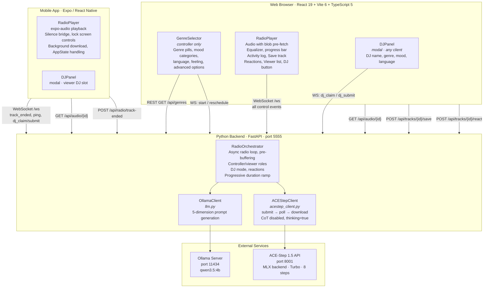
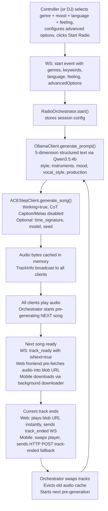

# Generative Radio — Build Specification (v4)

> **Snapshot date:** 2026-04-01
> **Supersedes:** `docs/BUILD_SPEC_V1.md` (v2), v3 (2026-03-18)
>
> This document describes the current state of the codebase — architecture, runtime behaviour, protocols, and implementation details — as a single reference for contributors and AI coding assistants.

---

## Table of Contents

1. [Project Overview](#1-project-overview)
2. [Architecture](#2-architecture)
3. [Tech Stack & Dependencies](#3-tech-stack--dependencies)
4. [Project Structure](#4-project-structure)
5. [Prerequisites & Setup](#5-prerequisites--setup)
6. [Runtime Configuration](#6-runtime-configuration)
7. [Backend Implementation](#7-backend-implementation)
8. [Frontend Implementation](#8-frontend-implementation)
9. [Mobile App Implementation](#9-mobile-app-implementation)
10. [WebSocket Protocol](#10-websocket-protocol)
11. [Multi-Listener: Controller / Viewer Model](#11-multi-listener-controller--viewer-model)
12. [DJ Mode — "Everyone Can Be a DJ"](#12-dj-mode--everyone-can-be-a-dj)
13. [Audio Pipeline & Pre-fetching](#13-audio-pipeline--pre-fetching)
14. [Language & Instrumental Support](#14-language--instrumental-support)
15. [Dimension-Based LLM Prompting](#15-dimension-based-llm-prompting)
16. [ACE-Step 1.5 Integration](#16-ace-step-15-integration)
17. [Advanced Options](#17-advanced-options)
18. [Save Track Feature](#18-save-track-feature)
19. [Reactions Feature](#19-reactions-feature)
20. [Launch Scripts](#20-launch-scripts)
21. [Memory, Duration & Performance](#21-memory-duration--performance)
22. [Remote Access (Cloudflare Tunnel)](#22-remote-access-cloudflare-tunnel)
23. [Security Headers](#23-security-headers)
24. [Debugging & Logging](#24-debugging--logging)
25. [Design System](#25-design-system)

---

## 1. Project Overview

**Generative Radio** is a fully local, offline AI radio app. Users select a genre, mood keywords, vocal language, and optional personal feeling — then the app generates and plays an endless stream of original AI-composed songs. Available as a **web app** (React + Vite) and a **mobile app** (Expo / React Native for iOS and Android).

### Core Loop

1. User picks **one genre** (36 options, or 🎲 Random) and optional **mood keywords** (60 keywords in 4 categories)
2. User selects a **vocal language** (11 languages or instrumental)
3. Optionally types a **free-text "what are you doing now?"**
4. Optionally configures **advanced options** (time signature, inference steps, DiT model variant, CoT flags, DJ cooldown)
5. A local LLM (Ollama + Qwen3.5:4b) generates a **dimension-based song prompt** (style, instruments, mood, vocal_style, production)
6. ACE-Step 1.5 generates a full MP3 with semantic audio codes for melodic structure
7. The song plays in the browser with a live activity log
8. While it plays, the **next song is pre-generated** in the background
9. The frontend pre-fetches audio bytes into a blob URL for zero-latency transition
10. Cycle repeats until the controller stops the session

**Everything runs locally.** No cloud APIs required after initial setup.

### Multi-Listener Model

Multiple browser clients can connect simultaneously. The first **local-network** connection becomes the **controller** (full UI: genre selection, start/stop, save track). Remote visitors (via Cloudflare tunnel) are always **viewers** (read-only player, DJ button available). When the controller disconnects, the next local viewer is automatically promoted.

The **mobile app** always joins as a viewer — it is a listening-only client with no session control capability.

---

## 2. Architecture



### Data Flow (One Song Cycle)



---

## 3. Tech Stack & Dependencies

| Component | Technology | Version / Notes |
|---|---|---|
| **Frontend** | React + Vite + TypeScript | React 19, Vite 6, TS 5.7+ |
| **Fonts** | Bebas Neue (display) + Space Grotesk (body) | Google Fonts (web); expo-google-fonts (mobile) |
| **Backend** | Python FastAPI | Python 3.11–3.12, FastAPI 0.115+ |
| **LLM** | Ollama + qwen3.5:4b | Always 4b (~2.5 GB); sufficient for prompt generation |
| **Music Gen** | ACE-Step 1.5 | MLX backend, turbo model, 8 inference steps (configurable) |
| **Package Mgmt** | uv (Python / ACE-Step), pip (backend venv), npm (JS) | |
| **Audio Format** | MP3 | Generated by ACE-Step, served via chunked streaming |
| **Tunnel** | cloudflared (optional) | Named tunnel (fixed domain) or Quick Tunnel (random URL) |
| **Mobile** | Expo SDK 55 + React Native 0.83 | Managed workflow, no native dirs before prebuild |
| **Mobile Audio** | expo-audio | Background playback + lock screen controls |
| **Mobile Download** | @kesha-antonov/react-native-background-downloader | Background HTTP download, iOS AppDelegate plugin |

### Python Dependencies (`backend/requirements.txt`)

```
fastapi>=0.115.0
uvicorn[standard]>=0.32.0
ollama>=0.5.1
httpx>=0.27.0
pydantic>=2.0.0
psutil>=6.0.0
```

### Node Dependencies (`frontend/package.json`)

```json
{
  "dependencies": {
    "react": "^19.0.0",
    "react-dom": "^19.0.0"
  },
  "devDependencies": {
    "@types/react": "^19.0.0",
    "@types/react-dom": "^19.0.0",
    "@vitejs/plugin-react": "^4.0.0",
    "typescript": "^5.7.0",
    "vite": "^6.0.0"
  }
}
```

Note: No PWA plugin. The app is a standard web app — no service worker, no installable manifest.

### Key Mobile Dependencies (`mobile/package.json`)

```json
{
  "expo": "55.0.x-canary",
  "expo-audio": "55.0.x-canary",
  "react-native": "0.83.4",
  "@kesha-antonov/react-native-background-downloader": "^4.5.4",
  "@react-navigation/native": "^7.x",
  "@react-navigation/native-stack": "^7.x",
  "@expo-google-fonts/bebas-neue": "*",
  "@expo-google-fonts/space-grotesk": "*"
}
```

---

## 4. Project Structure

```
generative-radio/
├── backend/
│   ├── main.py                # FastAPI app: REST endpoints, WebSocket handler, security middleware
│   ├── radio.py               # RadioOrchestrator: async loop, pre-buffering, roles, DJ mode, reactions, watchdog
│   ├── llm.py                 # OllamaClient: 5-dimension prompt generation with feeling injection
│   ├── acestep_client.py      # ACEStepClient: advanced options, CoT-disabled pipeline
│   ├── models.py              # Pydantic models: SongPrompt (5 dims), TrackInfo, WSMessage, ReactRequest
│   ├── genres.py              # 36 genres, 60 keywords (4 mood categories + instrument), 12 languages
│   ├── config.py              # Memory detection, model selection, progressive duration, mem_snapshot()
│   └── requirements.txt
├── frontend/
│   ├── index.html             # HTML entry + Google Fonts (Bebas Neue, Space Grotesk)
│   ├── package.json
│   ├── vite.config.ts         # Proxy /api→:5555, /ws→ws://:5555, allowedHosts; CSP headers
│   └── src/
│       ├── main.tsx
│       ├── App.tsx            # Role-aware routing, session info, DJ name, mid-session reschedule
│       ├── App.css            # Full stylesheet: fonts, genre pills, mood groups, advanced options
│       ├── types.ts           # Track, Genre, Keyword, AdvancedOptions, SessionInfo, DJ types
│       ├── components/
│       │   ├── GenreSelector.tsx   # Genre pills, grouped moods, feeling, advanced options
│       │   ├── RadioPlayer.tsx     # Player, activity log, save button, reactions, DJ button, viewer list
│       │   ├── DJPanel.tsx         # Modal: DJ name input + genre/mood/language selection
│       │   └── StatusBar.tsx       # Status dot + message + spinner + listener count
│       └── hooks/
│           └── useRadio.ts        # WS lifecycle, blob pre-fetch, DJ mode, reactions, media session
├── mobile/
│   ├── app.json               # Expo config: iOS/Android settings, background modes, plugins
│   ├── index.ts               # Expo entry point
│   ├── metro.config.js        # Monorepo resolver: watches root + packages/shared
│   ├── package.json
│   ├── assets/
│   │   ├── silence.mp3        # 20 KB silence file for iOS audio session bridge
│   │   └── icons/             # App icons (iOS + Android adaptive)
│   ├── plugins/
│   │   └── withBackgroundDownloader.js  # Config plugin: injects iOS AppDelegate background URL session handler
│   └── src/
│       ├── App.tsx            # Font loading, audio mode init, AppNavigator
│       ├── config.ts          # BACKEND_URL / WS_URL (dev: localhost, prod: radio.scrambler-lab.com)
│       ├── navigation/
│       │   └── AppNavigator.tsx    # Navigation container: RadioPlayer always shown, DJPanel modal
│       ├── hooks/
│       │   └── useRadio.ts        # expo-audio player, silence bridge, background download, AppState, lock screen
│       ├── utils/
│       │   └── downloadAudio.ts   # Background download to fixed file: track_current.mp3
│       └── components/
│           ├── RadioPlayer.tsx    # Mobile player UI: waveform, progress, transport, reactions, activity log
│           ├── GenreSelector.tsx  # Genre/mood selector (viewer DJ role only — via DJPanel)
│           ├── DJPanel.tsx        # DJ modal: genre, mood, language, feeling, name
│           └── theme.ts           # Design tokens: colors, fonts, border-radius
├── packages/
│   └── shared/
│       ├── package.json       # "@radio/shared" — imported by mobile via metro workspace resolution
│       └── src/
│           ├── index.ts
│           └── types.ts       # Shared TypeScript types (WSMessage variants, etc.)
├── patches/
│   └── @kesha-antonov+react-native-background-downloader+4.5.4.patch
├── scripts/
│   ├── setup.sh               # One-time: Homebrew, Ollama, LLM models, ACE-Step, venv, npm install
│   ├── start.sh               # Dev launch: Ollama, ACE-Step, backend (--reload), Vite dev server, cloudflared
│   └── start_prod.sh          # Prod launch: clears cache, npm run build, backend (no --reload), Vite preview
├── saved_tracks/              # Runtime: saved MP3 + JSON metadata (created on first save)
├── tracks_with_user_action/   # Runtime: reaction data per track (created on first reaction)
├── docs/
│   ├── BUILD_SPEC_V0.md
│   ├── BUILD_SPEC_V1.md
│   ├── acestep-enhanced-inputs-plan.md
│   ├── acestep-thinking-mode-analysis.md
│   ├── acestep-memory-vs-duration.md
│   ├── android-setup-guide.md
│   ├── apple-silicon-performance-tuning.md
│   ├── cloudflare-named-tunnel-setup.md
│   ├── everyone-can-be-a-dj.md
│   ├── genre-mood-expansion-plan.md
│   ├── ios-background-audio-investigation.md
│   ├── ios-simulator-guide.md
│   ├── llm-prompt-improvement-plan.md
│   ├── mobile-app-plan.md
│   ├── mobile-architecture-v2.md
│   ├── multi-listener-controller-viewer.md
│   ├── multiple-github-accounts-mac.md
│   ├── plain-text-llm-output-architecture.md
│   ├── research-local-ai-music-generation-mac.md
│   ├── save-track-feature.md
│   └── thumb-reaction-feature.md
├── BUILD_SPEC.md              # This file
└── README.md
```

---

## 5. Prerequisites & Setup

### Hardware Requirements

- Mac with Apple Silicon (M1/M2/M3/M4/M5)
- macOS 14+
- 16 GB+ unified memory (24 GB+ recommended, 64 GB for production)
- 50 GB+ free SSD space

### One-Time Setup

```bash
./scripts/setup.sh
```

7 steps: Homebrew, system tools (python, node, ffmpeg, git-lfs, cloudflared), uv, Ollama + model pull (qwen3.5:4b), ACE-Step 1.5 clone + sync, backend venv + pip install, frontend npm install.

### Environment Variables

```bash
export PYTORCH_MPS_HIGH_WATERMARK_RATIO=0.0
export PYTORCH_ENABLE_MPS_FALLBACK=1
```

Optional overrides: `OLLAMA_MODEL`, `MAX_DURATION_S`, `ALLOW_QUICK_TUNNEL=1` (dev only).

---

## 6. Runtime Configuration

### `config.py` — Resolved at Process Startup

**LLM Model:** Always `qwen3.5:4b` (~2.5 GB). Overridable via `OLLAMA_MODEL` env var.

**Audio Duration Tiers:**

| Unified Memory | Duration Strategy |
|---|---|
| ≤ 32 GB | 30 s fixed |
| 33–47 GB | 60 s fixed |
| ≥ 48 GB | Progressive: 60 → 120 → 180 s per track |

**Memory Monitoring:** `mem_snapshot()` returns a one-line RAM/swap summary (e.g. `RAM 18.2/24GB (76% used, 5.8GB free) | ⚠ Swap: 2.4GB`), logged before and after each LLM and ACE-Step call.

---

## 7. Backend Implementation

### `models.py`

```python
class SongPrompt(BaseModel):
    song_title: str
    style: str          # Genre, sub-genre, era reference
    instruments: str    # Key instruments
    mood: str           # Emotion, atmosphere, timbre texture
    vocal_style: str    # Vocal gender/timbre/technique (empty for instrumental)
    production: str     # Production style, rhythm feel, structure hints
    lyrics: str
    bpm: int            # 60–200
    key_scale: str
    duration: int       # 30–MAX_DURATION_S (clamped by validator)

    @property
    def tags(self) -> str:
        """Concatenate dimensions into ACE-Step caption."""

class TrackInfo(BaseModel):
    id: str
    song_title: str
    genre: str          # Resolved genre (e.g. "jazz"), even in random mode
    is_random: bool     # True if genre was randomly selected
    tags: str           # Joined from SongPrompt dimensions
    lyrics: str
    bpm: int
    key_scale: str
    duration: int
    audio_url: str

class ReactRequest(BaseModel):
    action: ReactionAction   # Enum: "thumb_up" | "thumb_down"
```

### `genres.py`

- **36 genres** with icon, label, and 5 subgenres each
- **60 keywords** total:
  - **40 mood keywords** in 4 backend categories: Emotion (12), Energy (8), Atmosphere (11), Texture (9) — the UI merges Energy→Emotion and Texture→Atmosphere, showing 2 mood groups of 20 each
  - **20 instrument keywords** in a separate Instrument category
- **12 language options** (11 languages + instrumental)
- Mood keywords ordered low → high energy within each display group

### `llm.py` — OllamaClient

- Generates `SongPrompt` via **labeled plain-text output** (`TITLE:`, `STYLE:`, … `LYRICS:`) parsed by `_parse_labeled_text()` — not JSON/structured output
- `think=False` — Qwen3 chain-of-thought disabled
- System prompt injects a prominent `CRITICAL REQUIREMENT` block at the top for non-English languages
- Language validation: `_lyrics_match_language()` checks Unicode script ranges; retries once with `language_retry=True` emphasis if wrong language detected
- Injects `feeling` parameter when non-empty
- Session history (last 10 titles) to ensure variety

### `acestep_client.py` — ACEStepClient

- `thinking=True` for semantic audio code generation
- `use_cot_caption=False`, `use_cot_metas=False` — preserves our LLM-crafted captions and metadata; `use_cot_language=True` — LM reads lyrics to detect language and instrumental intent
- Accepts advanced options: `time_signature`, `inference_steps`, `model`, `seed`; CoT flags are also configurable per-session via advancedOptions
- Model name auto-prefixed with `acestep-v15-` (e.g., `turbo` → `acestep-v15-turbo`)
- Full debug logging of payload before submission

### `radio.py` — RadioOrchestrator

- Session state: genres, keywords, language, feeling, advanced_options
- **Caches per track:** `audio_cache[id]`, `prompt_cache[id]`, `track_info_cache[id]`, `seed_cache[id]`
- Pre-buffering: next track generated in background
- `track_ended` debouncing (5 s window for multi-listener)
- Progressive duration via `get_progressive_duration(track_index)`
- Controller/viewer role management with deferred promotion
- **DJ mode:** `dj_claim`, `dj_submit` handlers; cooldown timer (`dj_unlock_at`); active DJ name broadcast
- **`reschedule`:** controller can change genres mid-session; cancels next track pre-generation and restarts with new settings
- **`play_now` watchdog:** after a configurable timeout past expected track end, broadcasts `play_now` to force transition on clients that missed the `ended` event (iOS backgrounding, screen lock, audio interruption)
- **Reactions:** `react()` and `get_reactions()` methods; per-track reaction state persisted to `tracks_with_user_action/`

### `main.py` — FastAPI Application

**REST endpoints:**
- `GET /api/genres` — genres, keywords, languages
- `GET /api/advanced-options` — last-used advanced options (for late-joining viewers)
- `GET /api/radio/status` — current state and track info
- `GET /api/audio/{track_id}` — chunked MP3 streaming (64 KB chunks, `Cache-Control: public max-age=3600`)
- `POST /api/tracks/{track_id}/save` — save MP3 + JSON to `saved_tracks/` (local clients only)
- `POST /api/tracks/{track_id}/react` — toggle thumb_up / thumb_down reaction (all clients)
- `GET /api/tracks/{track_id}/reactions` — current reaction counts + caller's vote
- `POST /api/radio/track-ended` — HTTP fallback for mobile clients that cannot send WS `track_ended` after sleep (delegates to same debounced handler)

**Security:** `SecurityHeadersMiddleware` injects HSTS, CSP, X-Frame-Options, X-Content-Type-Options, and other security headers on every response. CORS allows only `localhost:5173`, `127.0.0.1:5173`, and the named tunnel domain.

---

## 8. Frontend Implementation

### Design System

- **Fonts:** Bebas Neue (display: app title, song title, "Presented by") + Space Grotesk (body: all UI text)
- **Theme:** Deep dark (#0a0a0f), amber accent (#f59e0b), indigo for keywords, green for language
- **Genre selector:** Uppercase pill buttons (no icons), flex-wrap row
- **Mood selector:** Grouped by category (Emotion, Atmosphere, Instrument) with labeled sections

### `GenreSelector.tsx`

- Single-select genre pills (36 genres, uppercase, no icons) + 🎲 Random mode
- "← Back to Player" button (shown only when a track is already playing)
- Multi-select mood chips grouped by **3 display categories**: Emotion (20 pills), Atmosphere (20 pills), Instrument (20 pills) — each with a 🎲 Random option
- Single-select language chips
- "What are you doing now?" text input (200 char max)
- "Your name?" text input (50 char max)
- Collapsible **Advanced Options**:
  - Time Signature pills (None / 2/4 / 3/4 / 4/4 / 6/8)
  - Inference Steps slider (4–100, default 8 highlighted)
  - DiT Model Variant pills (turbo / turbo-shift1 / turbo-shift3 / turbo-continuous)
  - ACE-Step CoT Flags (Thinking, CoT Caption, CoT Metas, CoT Language) — per-flag toggles
  - DJ Cooldown slider (1–120 min, default 30)
  - Link to ACE-Step tutorial

### `RadioPlayer.tsx`

- Song title (Bebas Neue), session info (genre/mood/language), tags, BPM/key/duration
- **Lyrics display:** scrollable box below metadata; shows LLM-generated lyrics with structure tags
- **Transport controls:** ⏪ −10s / ▶⏸ play-pause / ⏩ +10s — available to all clients whenever a track is loaded
- Equalizer animation, progress bar
- Activity log (last 8 progress entries)
- **Reactions:** 👍 / 👎 buttons with live counts — all clients can react; toggle semantics
- **Save Track button** (controller only) — `POST /api/tracks/{id}/save`
- **Be the DJ button** (viewers, when DJ slot unlocked) — triggers `dj_claim` WS event
- Viewer list with IPs and "listening since" (controller only)
- "PRESENTED BY [NAME] AND GENERATIVE RADIO" footer
- Autoplay-unblock button for viewers on first load

### `DJPanel.tsx`

Modal component (full-screen overlay). Opens when a viewer's `dj_claim` is granted (`dj_claim_ack: granted=true`). Contains genre selector, mood keywords, language picker, feeling input, and DJ name input. Submits via `dj_submit` WS event. Controlled by `djPanelOpen` state in `useRadio`.

### `useRadio.ts` — Core Hook

**Returned interface:**

```ts
{
  role, status, currentTrack, nextReady,
  statusMessage, errorMessage, activityLog,
  listenerCount, viewers, audioDuration,
  progress, localPaused,
  // playback controls
  togglePlayPause, seekBackward, seekForward,
  // session control
  start, stop, updateSettings, saveTrack,
  audioRef,
  // reactions
  reactionState, reactToTrack,
  // DJ mode
  djLocked, djUnlockAt, activeDjName,
  djPanelOpen, claimDj, submitDj, closeDjPanel,
}
```

**Key behaviors:**
- WebSocket with exponential backoff reconnect (1 s → 16 s max)
- Blob pre-fetching for zero-latency transitions
- iOS autoplay unlock (silent play/pause on `start()` call, synchronous within gesture handler)
- Viewer first-track: forced `localPaused=true` until user taps Play (no autoplay without prior gesture)
- WS reconnect deduplication: only the current socket may trigger reconnect (prevents React StrictMode double-mount issue)
- **`audioDuration`:** actual decoded audio duration from `loadedmetadata` event (vs. LLM-requested duration)
- **`updateSettings`:** sends `reschedule` WS event; keeps current track playing, revokes pre-fetched blob
- **`play_now` handler:** server watchdog fires `play_now` when frontend missed `track_ended` — calls `handleTrackEnded()` to force transition
- **`visibilitychange` handler:** retries `audio.play()` when page returns to foreground (iOS backgrounding recovery)
- **Media Session API** (`navigator.mediaSession`): track metadata (title, artist, album, artwork) pushed to OS on every track change. Handlers: play, pause, seekbackward (−10s), seekforward (+10s) — feeds iOS Lock Screen and notification shade

---

## 9. Mobile App Implementation

The mobile app lives in `mobile/` and is an **Expo managed-workflow** React Native app (no committed `ios/` or `android/` dirs — generated on demand via `npx expo prebuild`). It is always a **viewer** — it connects to the backend WebSocket, plays the stream, and supports the DJ slot, but has no controller functionality (no genre selector, no start/stop, no save track).

### Architecture

- **Navigation:** `AppNavigator` → always shows `RadioPlayer`; `DJPanel` is a modal overlay
- **Audio:** `expo-audio` (`createAudioPlayer`) for MP3 playback + lock screen controls
- **Download:** `@kesha-antonov/react-native-background-downloader` downloads the next track to a fixed local file (`documents/track_current.mp3`) while the current track plays
- **Shared types:** `packages/shared` (monorepo package `@radio/shared`) imported via metro workspace resolution

### `mobile/src/hooks/useRadio.ts`

States: `idle | fetching | polling | playing | paused | error`

**Silence bridge pattern:**
- When a track ends (detected via `playbackStatusUpdate` listener), a looped `silence.mp3` is immediately started to keep the iOS audio session alive
- The silence bridge runs while the next track is being fetched/downloaded (~30–120 s for AI generation)
- Once the new player is ready, the silence player is stopped and the new track plays
- Prevents iOS from reclaiming the audio session during long generation gaps

**Background download:**
- `downloadAudio.ts` uses `@kesha-antonov/react-native-background-downloader` to download the next track audio byte-for-byte to a fixed filename
- On app wake (AppState `active`), any in-flight download task is re-attached to avoid duplicate fetches
- `patches/@kesha-antonov+react-native-background-downloader+4.5.4.patch` applies a fix to the library

**AppState handling:**
- On foreground: resumes player if playing, re-starts progress polling, resets stuck mutexes
- On background: relies on `UIBackgroundModes: audio` + `expo-audio` foreground service to keep playback alive

**WebSocket:**
- `ping` heartbeat every 20 s to keep connection alive during background
- Auto-reconnects with exponential backoff (1 s → 16 s max)
- `track_ended` is sent via both WS and HTTP fallback (`POST /api/radio/track-ended`) since the WS may not flush during iOS sleep

**Lock screen controls:**
- `player.setActiveForLockScreen(true, { title, artist, artworkUrl })` called on every new track
- Transport: play/pause, seek ±10 s
- One player at a time can control lock screen

### `mobile/app.json` — Key iOS/Android Config

```json
{
  "ios": {
    "infoPlist": {
      "UIBackgroundModes": ["audio", "fetch"],
      "NSLocalNetworkUsageDescription": "...",
      "NSBonjourServices": ["_http._tcp"],
      "NSBluetoothAlwaysUsageDescription": "..."
    }
  },
  "android": {
    "permissions": [
      "android.permission.INTERNET",
      "android.permission.WAKE_LOCK",
      "android.permission.FOREGROUND_SERVICE",
      "android.permission.FOREGROUND_SERVICE_MEDIA_PLAYBACK"
    ]
  },
  "plugins": [
    "./plugins/withBackgroundDownloader",
    ["expo-audio", { "enableBackgroundPlayback": true }]
  ]
}
```

`enableBackgroundPlayback: true` is required — it injects the `AudioControlsService` foreground service declaration into Android's manifest and applies additional AVAudioSession wiring on iOS. Without it, Android audio stops after ~3 minutes.

### `mobile/plugins/withBackgroundDownloader.js`

Expo config plugin (applied at `npx expo prebuild` time). Injects the `handleEventsForBackgroundURLSession:completionHandler:` method into the iOS AppDelegate — required for `@kesha-antonov/react-native-background-downloader` to receive callbacks when the app is backgrounded.

### Build & Test

```bash
cd mobile
npm install
npx expo prebuild --clean   # regenerates ios/ and android/ from app.json
npx expo run:ios --device   # or: eas build --platform ios
```

**Important:** Background audio does NOT work in Expo Go or a development client build. Test on a production/archive build only.

See `docs/ios-simulator-guide.md` for iOS setup and `docs/android-setup-guide.md` for Android.

---

## 10. WebSocket Protocol

### Client → Server Events

```json
{ "event": "start", "data": { "genres": ["jazz"], "keywords": ["chill"], "language": "en", "feeling": "...", "advancedOptions": { "timeSignature": "4", "inferenceSteps": 8, "model": "turbo" }, "djName": "Alice" } }
{ "event": "stop" }
{ "event": "skip" }
{ "event": "track_ended" }
{ "event": "reschedule", "data": { "genres": ["rock"], "keywords": [], "language": "en", "feeling": "...", "advancedOptions": {...} } }
{ "event": "dj_claim" }
{ "event": "dj_submit", "data": { "genres": ["pop"], "keywords": ["upbeat"], "language": "en", "feeling": "...", "djName": "Alice" } }
{ "event": "ping" }
```

The `ping` event (mobile only) is a keep-alive heartbeat — the backend discards it silently.

### Server → Client Events

- `role_assigned` (unicast): `{ "role": "controller" }` or `{ "role": "viewer" }`
- `track_ready` (broadcast): `{ "track": {...}, "isNext": false }`
- `status` (broadcast): `{ "state": "playing", "message": "...", "nextReady": true }`
- `progress` (broadcast): `{ "stage": "llm_thinking", "message": "..." }`
- `listener_count` (broadcast): `{ "count": 3 }`
- `viewer_list` (unicast to controller): `{ "viewers": [{ "ip": "...", "connectedAt": ... }] }`
- `dj_state` (broadcast): `{ "locked": true, "unlockAt": 1234567890, "activeDjName": "Alice" }`
- `dj_claim_ack` (unicast): `{ "granted": true }`
- `play_now` (broadcast): `{ "for_track_id": "abc123" }` — watchdog-triggered transition
- `error` (broadcast or unicast): `{ "message": "..." }`

Progress stages: `llm_thinking` → `llm_done` → `acestep_start` → `acestep_progress` (every 15 s) → `acestep_done`

---

## 11. Multi-Listener: Controller / Viewer Model

| Connection | Role | UI |
|---|---|---|
| First **local-network** WebSocket | Controller | GenreSelector → RadioPlayer (full controls + save) |
| All remote connections | Viewer | RadioPlayer (read-only, DJ button available) |
| Local connections when controller already active | Viewer | RadioPlayer (read-only) |
| Mobile app | Always Viewer | RadioPlayer (mobile UI, DJ button available) |

Late-join state sync: viewers receive `role_assigned`, current `track_ready`, `status`, `dj_state`, and last-used `advanced-options` on connect. Controller promotion happens on disconnect (immediate or deferred during generation).

### Controller Access Restriction (Local Network Only)

Only connections originating from a **private / loopback IP address** (RFC 1918: `10.x.x.x`, `172.16-31.x.x`, `192.168.x.x`, or `127.x.x.x`) can be assigned the controller role. Remote visitors — e.g. friends opening the Cloudflare tunnel URL — always receive `role_assigned: viewer` regardless of connection order.

**IP detection order** (`backend/radio.py: _resolve_client_ip`):
1. `CF-Connecting-IP` header — injected by Cloudflare with the real visitor IP
2. `X-Forwarded-For` header — first entry
3. `ws.client.host` — raw socket peer (direct LAN connections)

**Promotion restriction:** `_promote_next_controller()` skips remote viewers and only promotes the first local viewer.

---

## 12. DJ Mode — "Everyone Can Be a DJ"

Any viewer can request the DJ slot when the cooldown has expired. The flow:

1. Viewer clicks **Be the DJ** button → sends `dj_claim` WS event
2. Backend grants or denies based on cooldown lock:
   - **Granted:** sends `dj_claim_ack: { granted: true }` (unicast) → viewer's `DJPanel` opens
   - **Denied:** sends `dj_claim_ack: { granted: false }` with reason
3. DJ fills in the panel (name, genre, mood, language, feeling) and clicks Submit → sends `dj_submit`
4. Backend:
   - Stores new session config (genres, keywords, language, feeling)
   - Sets `activeDjName` and resets cooldown timer (`dj_unlock_at = now + dj_cooldown_s`)
   - Broadcasts `dj_state: { locked: true, unlockAt: ..., activeDjName: "Alice" }`
   - Cancels any pre-buffered next track, starts generating with DJ's settings
5. All clients see updated "PRESENTED BY ALICE" footer and DJ state

**DJ Cooldown** is set in Advanced Options (1–120 min, default 30 min). When the cooldown expires, `dj_state: { locked: false }` is broadcast and the Be the DJ button re-enables.

---

## 13. Audio Pipeline & Pre-fetching

### Web

Server-side: LLM → ACE-Step → MP3 bytes cached in `audio_cache[track_id]` → `StreamingResponse` (64 KB chunks, `Cache-Control: public, max-age=3600`). Previous track evicted on transition.

Also cached per track: `prompt_cache[track_id]` (SongPrompt), `track_info_cache[track_id]` (TrackInfo), `seed_cache[track_id]` (ACE-Step seed string) — used by save track and reactions endpoints.

Client-side: `track_ready(isNext=true)` triggers `fetch()` → `URL.createObjectURL(blob)`. On track end, `audio.src = blobUrl` for instant playback. Blob URLs revoked after use (active blob revoked after src swap, not before, to avoid HTMLAudioElement error state).

### Mobile

Mobile does not use the blob URL pattern. Instead:
1. On `track_ready(isNext=true)`, `downloadAudio.ts` starts a background download to `documents/track_current.mp3`
2. The download completes in the background (even while the screen is locked) via `@kesha-antonov/react-native-background-downloader`
3. When the current track ends, the player is re-created with the local `file://` URI
4. The silence bridge keeps the iOS audio session alive during the gap

---

## 14. Language & Instrumental Support

11 languages (English, Español, Français, Deutsch, Italiano, 中文, Ελληνικά, Suomi, Svenska, 日本語, 한국어) + "No Vocal" instrumental mode. Language flows through: user selection → WS start → LLM system prompt → ACE-Step `vocal_language`. Instrumental maps to `"unknown"` for ACE-Step.

---

## 15. Dimension-Based LLM Prompting

The LLM generates 5 dimension fields covering ACE-Step's 9 recommended caption dimensions:

| Field | Covers | Example |
|---|---|---|
| `style` | Style/Genre + Era | `"smooth jazz, bebop influences, late-night club"` |
| `instruments` | Instruments | `"mellow saxophone, soft piano, upright bass"` |
| `mood` | Emotion/Atmosphere + Timbre | `"warm, intimate, nostalgic, smoky, lush"` |
| `vocal_style` | Vocal Characteristics | `"male vocal, deep, smooth, crooner style"` |
| `production` | Production + Rhythm + Structure | `"live recording feel, spacious reverb, laid-back groove"` |

The `@property tags` concatenates all 5 into a single caption for ACE-Step.

**Lyrics rules** teach the LLM 15+ ACE-Step structure tags (`[Intro]`, `[Verse]`, `[Pre-Chorus]`, `[Chorus]`, `[Bridge]`, `[Outro]`, `[Instrumental]`, `[Guitar Solo]`, etc.), combined modifiers (`[Chorus - anthemic]`), syllable count (6–10 per line), UPPERCASE for intensity, parentheses for backing vocals, and metaphor discipline.

**Feeling injection:** when the user provides a free-text feeling, it is injected between the genre/keyword section and the rules section of the LLM system prompt.

---

## 16. ACE-Step 1.5 Integration

### Thinking Mode Configuration

`thinking=True` is kept for semantic audio code generation (melody, chords, orchestration encoded as 25 Hz latent hints for DiT). The CoT sub-features are configurable via Advanced Options (defaults match recommended settings):

- `use_cot_caption=False` (default) — don't rewrite our dimension-based caption
- `use_cot_metas=False` (default) — don't override our BPM/key/duration
- `use_cot_language=True` (default) — let LM read lyrics to auto-detect vocal language and instrumental intent

See `docs/acestep-thinking-mode-analysis.md` for the full rationale.

### API Endpoints Used

- `POST /release_task` — submit generation with advanced options
- `POST /query_result` — poll status (result is JSON string, must `json.loads()`)
- `GET /v1/audio?path=...` — download audio bytes
- `GET /health` — health check

---

## 17. Advanced Options

Controller-configurable per session, passed via WS `start` or `reschedule` events. Also returned by `GET /api/advanced-options` for late-joining clients:

| Option | API Param | Default | Values |
|---|---|---|---|
| Time Signature | `time_signature` | None (auto) | `"2"`, `"3"`, `"4"`, `"6"` |
| Inference Steps | `inference_steps` | 8 | 4–100 |
| DiT Model Variant | `model` | `turbo` | `turbo`, `turbo-shift1`, `turbo-shift3`, `turbo-continuous` |
| Thinking (CoT) | `cotThinking` | true | boolean |
| CoT Caption | `cotCaption` | false | boolean |
| CoT Metas | `cotMetas` | false | boolean |
| CoT Language | `cotLanguage` | true | boolean |
| DJ Cooldown | `djCooldownMin` | 30 | 1–120 min |

Model values are auto-prefixed: `turbo` → `acestep-v15-turbo`.

---

## 18. Save Track Feature

The controller can save the currently playing track via the **Save** button in RadioPlayer.

**Frontend:** calls `POST /api/tracks/{track_id}/save` (no body). Error is shown inline if save fails.

**Backend (`main.py`):**
1. Validates client is local-network (403 for remote)
2. Retrieves from caches: `audio_cache` (MP3 bytes), `prompt_cache` (SongPrompt), `track_info_cache` (TrackInfo), `seed_cache` (ACE-Step seed)
3. Creates `saved_tracks/` directory if missing
4. Writes `{safe_title}.{YYYY-MM-DD_HH-MM-SS}.mp3` and matching `.json` with full metadata

**JSON metadata includes:** trackId, savedAt, songTitle, genre, isRandom, bpm, keyScale, duration, language, keywords, style, instruments, mood, vocalStyle, production, lyrics, tags, seed, advancedOptions, audioFile.

---

## 19. Reactions Feature

Any connected listener (controller or viewer, web or mobile) can react to the currently playing track.

**Reaction types:** `thumb_up` / `thumb_down`

**Toggle semantics:**
- Sending the same reaction again removes the vote
- Sending the opposite reaction switches sides (removes old vote, adds new)

**Web frontend (`useRadio.ts`):**
- `reactToTrack(action)` calls `POST /api/tracks/{id}/react`
- `reactionState` contains `{ thumbUp: number, thumbDown: number, myVote: "thumb_up" | "thumb_down" | null }`
- Reaction counts are also broadcast via WebSocket so all connected clients update in real time

**Backend:**
- `POST /api/tracks/{track_id}/react` — body: `{ "action": "thumb_up" | "thumb_down" }`, identified by resolved client IP
- `GET /api/tracks/{track_id}/reactions` — returns counts + caller's current vote
- Reaction state persisted to `tracks_with_user_action/{track_id}.json`
- IP-based vote ownership; `asyncio.Lock` prevents concurrent write races

---

## 20. Launch Scripts

### `start.sh` — development (5 services)

1. **Ollama** — `ollama serve` (skipped if running)
2. **ACE-Step API** — `uv run acestep-api` with MLX (waits up to 60 min on first run)
3. **FastAPI backend** — `uvicorn main:app` on port 5555 with `--reload`
4. **Frontend** — `npm run dev` on port 5173 (Vite HMR dev server)
5. **Cloudflare tunnel** — named tunnel (`cloudflared tunnel run`) if `~/.cloudflared/config.yml` exists; otherwise quick tunnel fallback

Shutdown (`Ctrl+C`): kills backend, frontend, tunnel, Ollama. ACE-Step intentionally left running.

### `start_prod.sh` — production (step 0 + 5 services)

Adds a **step 0** before the services:
- Clears Vite transform cache (`node_modules/.vite`) and previous `dist/`
- Runs `npm ci` + `npm run build` (TypeScript compile → Vite bundle → `frontend/dist/`)

Then starts services with production settings:
3. **FastAPI backend** — `uvicorn main:app` on port 5555 **without** `--reload`
4. **Frontend** — `npm run preview` on port 5173 (serves compiled bundle; proxy config in `vite.config.ts` `preview` section)

All other steps (Ollama, ACE-Step, tunnel) are identical to `start.sh`.

---

## 21. Memory, Duration & Performance

| Duration | Est. Metal Buffer | Safe on |
|---|---|---|
| 30 s | ~3.8 GB | 16 GB+ |
| 60 s | ~9.7 GB | 24 GB+ |
| 120 s | ~21.5 GB | 48 GB+ |
| 180 s | ~33.3 GB | 48 GB+ (with margin) |

Formula: `memory_GB(t) = 9.7 + (t − 60) × 0.197`

### Port Summary

| Service | Port |
|---|---|
| Frontend (Vite) | 5173 |
| Backend (FastAPI) | 5555 |
| ACE-Step API | 8001 |
| Ollama | 11434 |

---

## 22. Remote Access (Cloudflare Tunnel)

**Named Tunnel (production):** Fixed domain `radio.scrambler-lab.com`. Requires one-time setup — see `docs/cloudflare-named-tunnel-setup.md`. `start.sh` detects `~/.cloudflared/config.yml` and runs `cloudflared tunnel run generative-radio`.

**Quick Tunnel (dev fallback):** Random `*.trycloudflare.com` URL. Used when no named tunnel config exists.

Both support WebSocket proxying natively. Configurable via `TUNNEL_NAME` and `TUNNEL_DOMAIN` env vars.

**Security interaction:** Cloudflare injects the `CF-Connecting-IP` header on all tunnel traffic. The backend reads this header to obtain the real visitor IP and determine whether they are on the local network. Remote visitors are automatically restricted to the viewer role. See §11 for the full access restriction model.

---

## 23. Security Headers

Both the FastAPI backend (`SecurityHeadersMiddleware` in `main.py`) and the Vite dev/preview server (`vite.config.ts`) inject the same set of HTTP security headers:

| Header | Value |
|---|---|
| `Strict-Transport-Security` | `max-age=31536000; includeSubDomains` |
| `X-Content-Type-Options` | `nosniff` |
| `X-Frame-Options` | `DENY` |
| `Referrer-Policy` | `strict-origin-when-cross-origin` |
| `Permissions-Policy` | `camera=(), microphone=(), geolocation=()` |
| `Cross-Origin-Opener-Policy` | `same-origin` |
| `Cross-Origin-Resource-Policy` | `same-site` |
| `Content-Security-Policy` | `default-src 'self'; connect-src 'self' wss: https:; font-src 'self' fonts.gstatic.com; style-src 'self' 'unsafe-inline' fonts.googleapis.com; script-src 'self'; worker-src 'self'; media-src 'self' blob:; img-src 'self' data:; frame-ancestors 'none'` |

`media-src 'self' blob:` is required for blob URL playback. `worker-src 'self'` is included for forward compatibility.

---

## 24. Debugging & Logging

### Log Files

```bash
tail -f /tmp/generative-radio-backend.log
tail -f /tmp/generative-radio-acestep.log
tail -f /tmp/generative-radio-frontend.log
tail -f /tmp/generative-radio-cloudflared.log
```

### Backend Log Format

```
HH:MM:SS [LEVEL] module: [component] message
```

Components: `[main]`, `[radio]`, `[llm]`, `[acestep]`, `[config]`. Each track generation tagged with a short UUID for correlation.

**Advanced options logging:** Before each ACE-Step call, `radio.py` logs `advanced_options`; `acestep_client.py` logs all params (steps, model, time_sig, seed) at info level and full payload at debug level.

### Frontend Log Prefixes

`[WS]`, `[Radio]`, `[Audio]`, `[GenreSelector]`, `[DJ]`

---

## 25. Design System

### Fonts

| Usage | Font | Size | Notes |
|---|---|---|---|
| App title ("Generative Radio") | Bebas Neue | 38px | 2px letter-spacing |
| Song title | Bebas Neue | 28px | 1.5px letter-spacing |
| "Presented by" footer | Bebas Neue | 12px | 1.5px letter-spacing |
| All body/UI text | Space Grotesk | Various | 400–700 weights |

Same fonts used in mobile via `@expo-google-fonts/bebas-neue` and `@expo-google-fonts/space-grotesk`.

### Color Tokens

| Token | Value | Usage |
|---|---|---|
| `--bg` | #0a0a0f | Page background |
| `--surface` | #111118 | Card/panel background |
| `--accent` | #f59e0b | Primary accent (amber) |
| `--indigo` | #6366f1 | Mood chip selected |
| `--green` | #22c55e | Language chip selected |
| `--text` | #f1f5f9 | Primary text |
| `--text-muted` | #64748b | Secondary text |

### Component Patterns

- **Genre selector:** Uppercase pill buttons (no icons), flex-wrap, accent border on selection
- **Mood keywords:** Grouped by category with small uppercase labels, indigo selection
- **Language chips:** Pill buttons, green selection, dashed border for instrumental
- **Advanced options:** Collapsible section, pill buttons for discrete choices, range slider for inference steps
- **DJ button:** Amber pill button, disabled with countdown timer when locked
- **Reactions:** Thumb up/down icon buttons with live counts, highlighted when user has voted
