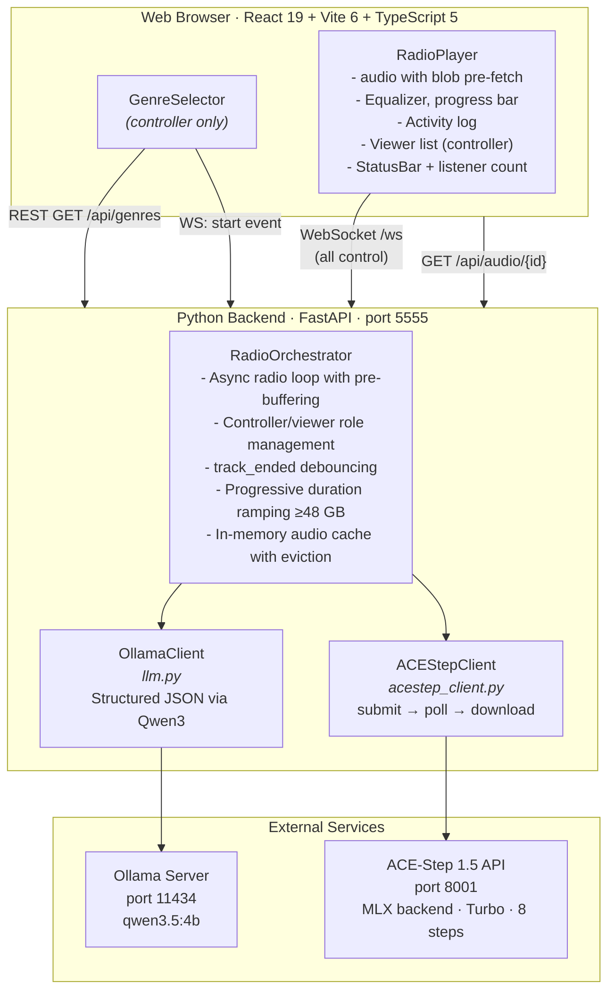
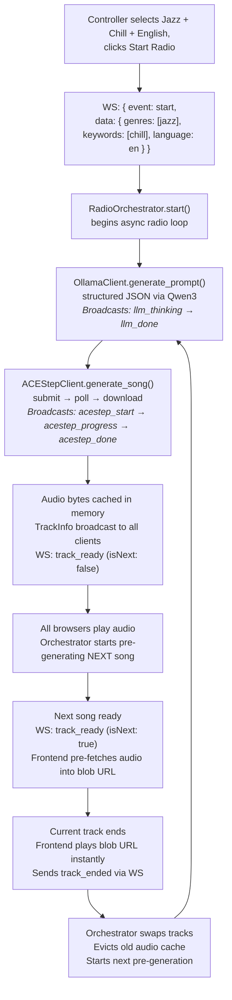

# Generative Radio — Build Specification (v1)

> **Snapshot date:** 2026-02-25
> **Supersedes:** `BUILD_SPEC_V0.md` (initial build spec)
>
> This document describes the current state of the codebase — architecture, runtime behaviour, protocols, and implementation details — as a single reference for contributors and AI coding assistants.

---

## Table of Contents

1. [Project Overview](#1-project-overview)
2. [Architecture](#2-architecture)
3. [Tech Stack & Dependencies](#3-tech-stack--dependencies)
4. [Project Structure](#4-project-structure)
5. [Prerequisites & Setup](#5-prerequisites--setup)
6. [Runtime Configuration](#6-runtime-configuration)
7. [Backend Implementation](#7-backend-implementation)
8. [Frontend Implementation](#8-frontend-implementation)
9. [WebSocket Protocol](#9-websocket-protocol)
10. [Multi-Listener: Controller / Viewer Model](#10-multi-listener-controller--viewer-model)
11. [Audio Pipeline & Pre-fetching](#11-audio-pipeline--pre-fetching)
12. [Language & Instrumental Support](#12-language--instrumental-support)
13. [ACE-Step 1.5 API Reference](#13-ace-step-15-api-reference)
14. [Ollama LLM Integration](#14-ollama-llm-integration)
15. [Launch Scripts](#15-launch-scripts)
16. [Memory, Duration & Performance](#16-memory-duration--performance)
17. [Remote Access (Cloudflare Tunnel)](#17-remote-access-cloudflare-tunnel)
18. [Debugging & Logging](#18-debugging--logging)

---

## 1. Project Overview

**Generative Radio** is a fully local, offline AI radio web app. Users select a genre and mood keywords, and the app generates and plays an endless stream of original AI-composed songs — like a radio station where every track is unique.

### Core Loop

1. User picks **one genre** and optional **mood keywords**
2. User selects a **vocal language** (11 languages or instrumental)
3. A local LLM (Ollama + Qwen3.5) acts as a "DJ brain" — generates a creative song prompt with tags, lyrics, BPM, key, and duration
4. The prompt is sent to ACE-Step 1.5 (local music generation) which produces a full MP3
5. The song plays in the browser with a live activity log
6. While it plays, the **next song is pre-generated** in the background
7. When the song ends, the next one plays seamlessly — the frontend pre-fetches audio bytes into a blob URL for zero-latency transition
8. Cycle repeats until the controller stops the session

**Everything runs locally.** No cloud APIs required after initial setup.

### Multi-Listener Model

Multiple browser clients can connect simultaneously. The first connection becomes the **controller** (full UI: genre selection, start/stop/skip). All subsequent connections are **viewers** (read-only player, real-time audio sync). When the controller disconnects, the next viewer is promoted.

---

## 2. Architecture



### Data Flow (One Song Cycle)



---

## 3. Tech Stack & Dependencies

| Component | Technology | Version / Notes |
|---|---|---|
| **Frontend** | React + Vite + TypeScript | React 19, Vite 6, TS 5.7+ |
| **Backend** | Python FastAPI | Python 3.11–3.12, FastAPI 0.115+ |
| **LLM** | Ollama + qwen3.5:4b | Always 4b (~2.5 GB); sufficient for prompt generation |
| **Music Gen** | ACE-Step 1.5 | MLX backend, turbo model, 8 inference steps |
| **Package Mgmt** | uv (Python / ACE-Step), pip (backend venv), npm (JS) | |
| **Audio Format** | MP3 | Generated by ACE-Step, served via chunked streaming |
| **Tunnel** | cloudflared (optional) | Cloudflare Quick Tunnel on port 5173 |

### Python Dependencies (`backend/requirements.txt`)

```
fastapi>=0.115.0
uvicorn[standard]>=0.32.0
ollama>=0.5.1
httpx>=0.27.0
pydantic>=2.0.0
psutil>=6.0.0
```

### Node Dependencies (`frontend/package.json`)

```json
{
  "dependencies": {
    "react": "^19.0.0",
    "react-dom": "^19.0.0"
  },
  "devDependencies": {
    "@types/react": "^19.0.0",
    "@types/react-dom": "^19.0.0",
    "@vitejs/plugin-react": "^4.0.0",
    "typescript": "^5.7.0",
    "vite": "^6.0.0"
  }
}
```

---

## 4. Project Structure

```
generative-radio/
├── backend/
│   ├── main.py                # FastAPI app: REST endpoints, WebSocket handler, CORS, lifespan
│   ├── radio.py               # RadioOrchestrator: async loop, pre-buffering, controller/viewer roles
│   ├── llm.py                 # OllamaClient: multi-language prompt generation with structured output
│   ├── acestep_client.py      # ACEStepClient: task submission, polling, audio download pipeline
│   ├── models.py              # Pydantic models: SongPrompt, TrackInfo, RadioState, WSMessage
│   ├── genres.py              # Genre, keyword, and language definitions (static data)
│   ├── config.py              # Runtime config: memory detection, model selection, duration tiers, mem_snapshot()
│   └── requirements.txt       # Python dependencies
├── frontend/
│   ├── index.html             # HTML entry point (📻 emoji favicon)
│   ├── package.json           # Node dependencies
│   ├── tsconfig.json          # TypeScript project references
│   ├── tsconfig.app.json      # App TypeScript config
│   ├── tsconfig.node.json     # Node TypeScript config
│   ├── vite.config.ts         # Vite config: proxy /api→:5555, /ws→ws://:5555, allowedHosts
│   └── src/
│       ├── main.tsx           # React entry point (StrictMode)
│       ├── App.tsx            # Root: role-aware routing (controller/viewer/connecting)
│       ├── App.css            # Full stylesheet: dark theme, genre grid, player, equalizer, status bar
│       ├── types.ts           # TypeScript types: Track, Genre, Keyword, Language, WS messages, roles
│       ├── components/
│       │   ├── GenreSelector.tsx   # Single-genre select + keyword chips + language picker
│       │   ├── RadioPlayer.tsx     # Player card, activity log, viewer list, autoplay-unblock
│       │   └── StatusBar.tsx       # Status dot + message + spinner + listener count
│       └── hooks/
│           └── useRadio.ts        # WebSocket lifecycle, audio blob pre-fetch, role state, reconnect
├── scripts/
│   ├── setup.sh               # One-time: Homebrew, Ollama, LLM models, ACE-Step, venv, npm install
│   └── start.sh               # Launch: Ollama, ACE-Step, backend, frontend, cloudflared
├── docs/
│   ├── acestep-memory-vs-duration.md     # Memory vs. duration research and formulas
│   ├── multi-listener-controller-viewer.md  # Controller/viewer design document
│   └── multiple-github-accounts-mac.md   # SSH key setup for multi-account GitHub
├── BUILD_SPEC.md              # This file
├── BUILD_SPEC_V0.md           # Original build spec (superseded)
├── README.md                  # User-facing setup & usage
├── research-local-ai-music-generation-mac.md  # Background research
└── .gitignore
```

---

## 5. Prerequisites & Setup

### Hardware Requirements

- Mac with Apple Silicon (M1/M2/M3/M4)
- macOS 14+
- 16 GB+ unified memory (24 GB+ recommended for development, 64 GB for production)
- 50 GB+ free SSD space

### One-Time Setup

```bash
./scripts/setup.sh
```

`setup.sh` performs 7 steps:

1. **Homebrew** — installs if missing
2. **System tools** — `python@3.11`, `node`, `ffmpeg`, `git-lfs`, `cloudflared`
3. **uv** — Python package manager (used by ACE-Step)
4. **Ollama** — local LLM server; pulls `qwen3.5:4b` (temporarily starts Ollama server if needed)
5. **ACE-Step 1.5** — clones to sibling directory `../ACE-Step-1.5`, runs `uv sync`
6. **Backend** — creates `backend/.venv` Python venv, installs `requirements.txt`
7. **Frontend** — runs `npm install` in `frontend/`

### Environment Variables

```bash
# Add to ~/.zshrc for optimal MPS performance
export PYTORCH_MPS_HIGH_WATERMARK_RATIO=0.0
export PYTORCH_ENABLE_MPS_FALLBACK=1
```

(`start.sh` also sets these at launch time.)

---

## 6. Runtime Configuration

### `config.py` — Resolved at Process Startup

All configuration is determined once when the backend starts, based on the machine's unified memory.

#### LLM Model Selection

**Always `qwen3.5:4b`** (~2.5 GB). The smaller model frees memory for ACE-Step's MLX VAE Metal buffers, which is the primary performance bottleneck.

Overridable via `OLLAMA_MODEL` environment variable.

#### Audio Duration Tiers

Duration is selected based on unified memory and, on large-memory machines, ramps up progressively per track:

| Unified Memory | Duration Strategy | Rationale |
|---|---|---|
| ≤ 32 GB | **30 s** (all tracks) | Fast iteration on dev machines |
| 33–47 GB | **60 s** (all tracks) | Safe within MLX VAE Metal buffer limits |
| ≥ 48 GB | **Progressive ramp:** 60 s → 120 s → 180 s | First track starts quickly; subsequent tracks get longer |

Progressive ramp (≥ 48 GB only):

| Track Index | Duration |
|---|---|
| 0 (first) | 60 s |
| 1 (second) | 120 s |
| 2+ (third onward) | 180 s |

Overridable via `MAX_DURATION_S` environment variable (disables progressive ramp).

#### Memory Monitoring

`mem_snapshot()` returns a one-line string for log messages:

```
RAM 18.2/24GB (76% used, 5.8GB free)
RAM 23.1/24GB (96% used, 0.9GB free) | ⚠ Swap: 2.4GB
```

Logged before and after each LLM and ACE-Step call.

---

## 7. Backend Implementation

### `models.py` — Data Models

```python
class RadioState(str, Enum):
    IDLE = "idle"
    GENERATING = "generating"
    PLAYING = "playing"
    BUFFERING = "buffering"
    STOPPED = "stopped"

class SongPrompt(BaseModel):
    song_title: str
    tags: str           # Comma-separated ACE-Step style tags
    lyrics: str         # [verse], [chorus], [bridge] markers; empty string for instrumental
    bpm: int            # 60–200
    key_scale: str      # e.g. "C Major", "Am", "F# Minor"
    duration: int       # 30–MAX_DURATION_S (clamped by field_validator)

class TrackInfo(BaseModel):
    id: str             # UUID
    song_title: str
    tags: str
    lyrics: str
    bpm: int
    key_scale: str
    duration: int
    audio_url: str      # /api/audio/{id}

class WSMessage(BaseModel):
    event: str
    data: dict
```

`SongPrompt.duration` has a `field_validator` that hard-caps the value at `MAX_DURATION_S` as a safety net against LLM output that ignores the prompt instruction.

### `genres.py` — Static Data

- **12 genres** with icon, label, and 5 subgenres each: Rock, Pop, Jazz, Electronic, Hip-Hop, Classical, Lo-Fi, Ambient, R&B, Folk, Metal, Country
- **15 mood keywords**: Energetic, Melancholic, Dreamy, Aggressive, Chill, Upbeat, Dark, Romantic, Ethereal, Groovy, Epic, Nostalgic, Minimal, Psychedelic, Cinematic
- **12 language options**: English, Español, Français, Deutsch, Italiano, 中文, Ελληνικά, Suomi, Svenska, 日本語, 한국어, No Vocal (instrumental)

### `llm.py` — OllamaClient

- Wraps `ollama.chat()` in `asyncio.to_thread()` to avoid blocking the event loop
- Generates `SongPrompt` via structured output (`format=SongPrompt.model_json_schema()`)
- `think=False` — disables Qwen3 chain-of-thought (unnecessary latency for JSON generation)
- System prompt includes: genres, keywords, language rules, session history (last 10 titles), target duration
- Language-aware: lyrics instruction changes based on selected language; instrumental mode sets lyrics to empty string
- Supports env var override: `OLLAMA_MODEL`

### `acestep_client.py` — ACEStepClient

Full async pipeline using `httpx.AsyncClient`:

1. **`submit_task(prompt, vocal_language)`** → `POST /release_task` → returns `task_id`
   - Maps `prompt.tags` → ACE-Step `prompt` field
   - Maps `"instrumental"` language sentinel → `"unknown"` for ACE-Step
   - Fixed params: `thinking=true`, `batch_size=1`, `audio_format="mp3"`, `inference_steps=8`
2. **`poll_task(task_id)`** → `POST /query_result` every 2s, up to 5-minute timeout
   - **Important:** ACE-Step `result` field is a JSON string that must be `json.loads()`-parsed a second time
3. **`get_audio_bytes(audio_path)`** → `GET /v1/audio?path=...` → returns raw MP3 bytes
4. **`generate_song(prompt)`** → orchestrates submit → poll → download → returns `(bytes, metadata)`

### `radio.py` — RadioOrchestrator

The central state machine managing the radio session:

**State management:**
- `state: RadioState` — IDLE → GENERATING → PLAYING ↔ BUFFERING → STOPPED
- `genres`, `keywords`, `language` — session configuration
- `history: list[str]` — last 20 song titles (passed to LLM for variety)
- `current_track`, `next_track` — TrackInfo instances
- `audio_cache: dict[str, bytes]` — in-memory MP3 cache, evicts previous track on transition

**Async primitives:**
- `_task` — main radio loop (`asyncio.Task`)
- `_prebuffer_task` — background next-track generation
- `_stop_event`, `_track_ended_event`, `_next_track_ready_event` — coordination events

**Controller/viewer role tracking:**
- `_controller_ws` — the one WebSocket that can start/stop/skip
- `_pending_promotion` — deferred promotion flag when controller disconnects mid-generation
- `_ws_meta` — per-connection metadata (IP, connected_at) for the viewer list

**Key behaviours:**
- **Pre-buffering:** while a track plays, the next track is generated in the background and broadcast as `track_ready(isNext=true)`
- **track_ended debouncing:** with N listeners, only the first `track_ended` within 5 seconds is honoured
- **Progressive duration:** `get_progressive_duration(track_index)` returns the target duration for each track
- **Progress broadcasting:** 5-stage progress events during generation (see §9)
- **Graceful cleanup:** `stop()` cancels prebuffer tasks, clears audio cache, resets all state

### `main.py` — FastAPI Application

**REST endpoints (read-only):**
- `GET /api/genres` — returns genre, keyword, and language lists
- `GET /api/radio/status` — current state, track info, listener count, model name
- `GET /api/audio/{track_id}` — serves cached MP3 via `StreamingResponse` (64 KB chunks, `Cache-Control: public, max-age=3600`)

**WebSocket endpoint (`/ws`):**
- Accepts connection → `radio.add_ws(websocket)`
- Routes incoming events: `start`, `stop`, `skip`, `track_ended`
- On disconnect → `radio.remove_ws(websocket)`

**Lifespan:** logs startup config; on shutdown calls `radio.stop()` and `acestep.close()`.

---

## 8. Frontend Implementation

### Design System

- **Theme:** Deep dark (#0a0a0f background), warm amber (#f59e0b accent), indigo for keywords, green for language chips
- **Layout:** Centered single-column, max-width 600px (selector) / 480px (player)
- **Typography:** System fonts (-apple-system, BlinkMacSystemFont, etc.)
- **Animations:** CSS equalizer bars, status dot pulse, activity log fade-in, progress bar transition

### `App.tsx` — Root Component

Role-aware routing:

| `role` value | `radio.status` | View rendered |
|---|---|---|
| `null` | any | "Connecting..." spinner |
| `"viewer"` | any | `<RadioPlayer readonly>` (always) |
| `"controller"` | idle/stopped | `<GenreSelector>` |
| `"controller"` | generating/playing/buffering | `<RadioPlayer>` (full controls) |

When a viewer is promoted to controller mid-session, a `useEffect` automatically switches to the player view.

### `GenreSelector.tsx`

- **Single-select genre grid** (3 columns, 2 on mobile) — one genre at a time, default: Rock
- **Multi-select keyword chips** (pill-shaped, wrap) — optional mood modifiers
- **Single-select language row** — 11 languages + "No Vocal" (instrumental, dashed border)
- **Summary line** shows selection: `"Rock — Dreamy, Chill · English"`
- **Start Radio button** — enabled when a genre is selected

### `RadioPlayer.tsx`

Two modes based on `readonly` prop:

| Element | Controller | Viewer |
|---|---|---|
| "← Change genres" back button | Shown | Hidden |
| "CONTROLLER" badge | Shown | Hidden |
| "Now Listening" badge | Hidden | Shown |
| Invite text + viewer list | Shown | Hidden |
| "Tap to Listen" (autoplay blocked) | N/A | Shown when needed |
| Track info, equalizer, progress | Same | Same |
| Activity log | Same (during generating/buffering) | Same |
| StatusBar | Same | Same |

**Activity log:** shows the last 8 progress entries with stage-specific icons (🎙 🎵 🎹 ⏳ ✓), auto-scrolls to bottom.

**Viewer list (controller only):** shows connected viewer IPs (abbreviated for IPv6) and "listening since" timestamps.

### `StatusBar.tsx`

- Status dot: green (playing + next ready), amber pulsing (generating/buffering/playing without next), dim (idle/stopped)
- Message: contextual status text
- Spinner: shown during generating/buffering
- Listener count: people icon + count (shown when > 0)

### `useRadio.ts` — Core Hook

**State exposed:**

```typescript
interface UseRadioReturn {
  role: ClientRole | null;      // "controller" | "viewer" | null (connecting)
  status: RadioStatus;          // "idle" | "connecting" | "generating" | "playing" | "buffering" | "stopped"
  currentTrack: Track | null;
  nextReady: boolean;
  statusMessage: string;
  errorMessage: string | null;
  activityLog: ActivityEntry[];
  listenerCount: number;
  audioBlocked: boolean;        // true when browser blocks autoplay (viewer)
  viewers: ViewerInfo[];        // controller-only: connected viewer metadata
  progress: number;             // 0–1 audio playback progress
  start(genres, keywords, language): Promise<void>;
  stop(): Promise<void>;
  rewind(): void;
  unblockAudio(): void;
  audioRef: RefObject<HTMLAudioElement>;
}
```

**WebSocket lifecycle:**
- Connects on mount, reconnects on close with exponential backoff (1s → 2s → 4s → ... → 16s max)
- StrictMode-safe: only the current socket can trigger reconnection
- Relative URL `/ws` — proxied by Vite in dev, works natively behind tunnel

**Audio blob pre-fetching:**
- When `track_ready(isNext=true)` arrives, `fetch()` downloads the MP3 bytes and creates a `URL.createObjectURL(blob)`
- When the current track ends, audio.src is set to the blob URL for instant playback
- Previous blob URLs are revoked to prevent memory leaks

**iOS autoplay unlock:**
- `start()` synchronously calls `audio.play()` (muted) then `audio.pause()` within the user gesture handler
- This unlocks the `<audio>` element for future `play()` calls from WebSocket callbacks

---

## 9. WebSocket Protocol

### Connection

```
ws://localhost:5555/ws   (direct)
/ws                      (via Vite proxy or tunnel)
```

### Client → Server Events

All control is WebSocket-only. REST start/stop/skip endpoints do not exist.

```json
{ "event": "start", "data": { "genres": ["jazz"], "keywords": ["chill"], "language": "en" } }
{ "event": "stop" }
{ "event": "skip" }
{ "event": "track_ended" }
```

- `start`, `stop`, `skip` are **controller-only** — non-controllers receive an `error` event
- `track_ended` is sent by **all clients** — server debounces duplicates (5s window)

### Server → Client Events

#### `role_assigned` (unicast)

Sent to individual clients on connect or promotion. Never broadcast.

```json
{ "event": "role_assigned", "data": { "role": "controller" } }
{ "event": "role_assigned", "data": { "role": "viewer" } }
```

#### `track_ready` (broadcast)

```json
{
  "event": "track_ready",
  "data": {
    "track": {
      "id": "a1b2c3d4-...",
      "songTitle": "Midnight Boulevard",
      "tags": "smooth jazz, mellow saxophone, soft piano",
      "lyrics": "[verse]\nMoonlight falls on city streets...",
      "bpm": 85,
      "keyScale": "Bb Major",
      "duration": 60,
      "audioUrl": "/api/audio/a1b2c3d4-..."
    },
    "isNext": false
  }
}
```

- `isNext: false` — play this track now (first track, or buffering-recovery)
- `isNext: true` — pre-buffer this track (frontend pre-fetches audio bytes)

#### `status` (broadcast)

```json
{
  "event": "status",
  "data": {
    "state": "playing",
    "message": "Playing — next track ready",
    "nextReady": true
  }
}
```

#### `progress` (broadcast)

Emitted during track generation to populate the activity log:

```json
{ "event": "progress", "data": { "stage": "llm_thinking", "message": "DJ is writing the next song prompt…" } }
{ "event": "progress", "data": { "stage": "llm_done", "message": "\"Midnight Boulevard\" · 85 BPM · Bb Major", "title": "...", "tags": "...", "bpm": 85, "key": "Bb Major", "llmSeconds": 3.2 } }
{ "event": "progress", "data": { "stage": "acestep_start", "message": "Composing \"Midnight Boulevard\"…", "title": "..." } }
{ "event": "progress", "data": { "stage": "acestep_progress", "message": "Still composing \"Midnight Boulevard\"… (30s)", "elapsed": 30 } }
{ "event": "progress", "data": { "stage": "acestep_done", "message": "\"Midnight Boulevard\" ready in 45s — loading…", "title": "...", "aceSeconds": 45.1 } }
```

Stages: `llm_thinking` → `llm_done` → `acestep_start` → `acestep_progress` (every 15s) → `acestep_done`

#### `listener_count` (broadcast)

```json
{ "event": "listener_count", "data": { "count": 3 } }
```

Broadcast whenever a client connects or disconnects.

#### `viewer_list` (unicast to controller)

```json
{
  "event": "viewer_list",
  "data": {
    "viewers": [
      { "ip": "192.168.1.42", "connectedAt": 1740000000 }
    ]
  }
}
```

Sent only to the controller when the viewer list changes.

#### `error` (broadcast or unicast)

```json
{ "event": "error", "data": { "message": "Only the host can start the radio" } }
```

---

## 10. Multi-Listener: Controller / Viewer Model

### Role Assignment

| Connection | Role | UI |
|---|---|---|
| First WebSocket | Controller | GenreSelector → RadioPlayer (full controls) |
| All subsequent | Viewer | RadioPlayer (read-only, always) |

### Late-Join State Sync

When a viewer connects while a session is active, the server immediately unicasts:
1. `role_assigned: viewer`
2. `track_ready(isNext: false)` — current track metadata (if playing)
3. `status` — current state + message

### Controller Promotion

When the controller disconnects:

| Server state | Promotion timing |
|---|---|
| IDLE / STOPPED / PLAYING (no prebuffer) | Immediate — first viewer is promoted |
| GENERATING / BUFFERING (prebuffer running) | Deferred — promoted after current generation finishes |

After promotion:
- Promoted client receives `role_assigned: controller`
- Their UI transitions from read-only to full controls (already showing RadioPlayer)
- Other viewers are unaffected

If no viewers remain when the controller disconnects, `_controller_ws = None` and the next connection becomes controller.

### IP Normalization

IPv6-mapped IPv4 addresses are normalized: `::ffff:192.168.1.42` → `192.168.1.42`, `::1` → `127.0.0.1`.

---

## 11. Audio Pipeline & Pre-fetching

### Server-Side

1. LLM generates `SongPrompt` → ACE-Step generates MP3 bytes
2. Bytes stored in `RadioOrchestrator.audio_cache[track_id]`
3. `GET /api/audio/{track_id}` serves bytes via `StreamingResponse` (64 KB chunks)
4. `Cache-Control: public, max-age=3600` allows browser-side caching
5. Previous track's bytes are evicted from cache on transition

### Client-Side Pre-fetching

1. Server broadcasts `track_ready(isNext: true)` with the next track's metadata
2. Frontend immediately `fetch()`es the audio URL and creates a `URL.createObjectURL(blob)`
3. When the current track ends, `audio.src = blobUrl` — **zero network wait**
4. If pre-fetch hasn't completed, falls back to direct backend URL
5. Blob URLs are revoked after use to prevent memory leaks

### Autoplay Handling

- **Controllers:** `start()` fires a silent play/pause on the `<audio>` element within the button click handler to unlock autoplay on iOS
- **Viewers:** if `audio.play()` throws `NotAllowedError`, a "Tap to Listen" button is shown; clicking it resumes from the beginning

---

## 12. Language & Instrumental Support

### Supported Languages

| Code | Label | LLM Behaviour |
|---|---|---|
| `en` | English | Lyrics in English |
| `es` | Español | Lyrics in Spanish |
| `fr` | Français | Lyrics in French |
| `de` | Deutsch | Lyrics in German |
| `it` | Italiano | Lyrics in Italian |
| `zh` | 中文 | Lyrics in Chinese (Mandarin) |
| `el` | Ελληνικά | Lyrics in Greek |
| `fi` | Suomi | Lyrics in Finnish |
| `sv` | Svenska | Lyrics in Swedish |
| `ja` | 日本語 | Lyrics in Japanese |
| `ko` | 한국어 | Lyrics in Korean |
| `instrumental` | No Vocal | Lyrics set to empty string; tags include "no vocals" |

### How Language Flows Through the System

1. **Frontend:** user selects language in GenreSelector → sent in WS `start` event
2. **RadioOrchestrator:** stores `self.language`, passes to LLM and ACE-Step
3. **LLM (`llm.py`):** system prompt instructs "Write all lyrics in {Language}" or "INSTRUMENTAL TRACK — set lyrics to empty string"
4. **ACE-Step (`acestep_client.py`):** `vocal_language` parameter set to ISO code; `"instrumental"` mapped to `"unknown"` (ACE-Step's auto-detect sentinel)

---

## 13. ACE-Step 1.5 API Reference

### Starting the Server (macOS)

```bash
cd /path/to/ACE-Step-1.5
ACESTEP_LM_BACKEND=mlx TOKENIZERS_PARALLELISM=false \
  uv run acestep-api --host 127.0.0.1 --port 8001
```

### Endpoints Used

#### POST /release_task — Submit Generation

```json
{
  "prompt": "smooth jazz, mellow saxophone, soft piano, chill vibes",
  "lyrics": "[verse]\nMoonlight falls...",
  "bpm": 85,
  "key_scale": "Bb Major",
  "audio_duration": 60,
  "vocal_language": "en",
  "thinking": true,
  "batch_size": 1,
  "audio_format": "mp3",
  "inference_steps": 8,
  "use_random_seed": true
}
```

Returns: `{ "data": { "task_id": "..." } }`

#### POST /query_result — Poll Status

```json
{ "task_id_list": ["..."] }
```

Returns `status: 0` (running), `1` (succeeded), or `2` (failed).

**Critical:** The `result` field is a **JSON string** — must be parsed with `json.loads()` to get the result array.

#### GET /v1/audio?path=... — Download Audio

Returns raw audio bytes with appropriate Content-Type.

#### GET /health — Health Check

Returns 200 with `{"data": {"status": "ok"}}`.

---

## 14. Ollama LLM Integration

### Model

Always `qwen3.5:4b` (~5.5 GB, ~35 tok/s on Apple Silicon). Overridable via `OLLAMA_MODEL` env var.

### Structured Output

Uses the `ollama` Python SDK with `format=SongPrompt.model_json_schema()` to constrain output to valid JSON matching the Pydantic schema.

### Thinking Mode

`think=False` — Qwen3's chain-of-thought mode is disabled. It adds latency without improving structured JSON output quality.

### System Prompt Structure

```
You are a creative AI radio DJ...

SELECTED GENRES: {genres}
SELECTED MOODS / KEYWORDS: {keywords}

Songs already played this session — avoid repeating similar themes or styles:
  - {title_1}
  - {title_2}
  ...

RULES:
- {language-specific lyrics instruction}
- Write 2–4 lyric sections using [verse], [chorus], [bridge] markers
- Tags must be comma-separated musical style descriptors
- Vary sub-genre, tempo, key, mood between songs
- Duration must be exactly {target_duration} seconds
```

### Thread Safety

`ollama.chat()` is synchronous and blocks. It's wrapped in `asyncio.to_thread()` to avoid blocking the FastAPI event loop.

---

## 15. Launch Scripts

### `scripts/start.sh`

Launches 5 services in order:

1. **Ollama** — `ollama serve` (skipped if already running)
2. **ACE-Step API** — `uv run acestep-api` with MLX backend (waits up to 60 min for first-run model download; skipped if port 8001 already responding)
3. **FastAPI backend** — `uvicorn main:app` on port 5555 with `--reload` (clears stale port first)
4. **Frontend** — `npm run dev` on port 5173 (clears stale port first)
5. **Cloudflare tunnel** — `cloudflared tunnel --url http://localhost:5173` (skipped if cloudflared not installed)

Shutdown (`Ctrl+C`): kills backend, frontend, tunnel, and Ollama (if started by the script). **ACE-Step is intentionally left running** to avoid its multi-minute warm-up penalty.

### `scripts/setup.sh`

One-time setup (7 steps) — see §5 for details.

---

## 16. Memory, Duration & Performance

### Memory vs. Duration (Apple Silicon)

ACE-Step's MLX VAE requires a single contiguous Metal buffer. Approximate requirements:

| Duration | Est. Metal Buffer | Safe on |
|---|---|---|
| 30 s | ~3.8 GB | 16 GB+ machines |
| 60 s | ~9.7 GB | 24 GB+ machines |
| 120 s | ~21.5 GB | 48 GB+ machines |
| 180 s | ~33.3 GB | 48 GB+ machines (with margin) |

Formula: `memory_GB(t) = 9.7 + (t − 60) × 0.197`

See `docs/acestep-memory-vs-duration.md` for the full analysis, including the distinction between contiguous Metal buffers and total RAM.

### Duration Tiers (Implemented in `config.py`)

| Unified Memory | Strategy |
|---|---|
| ≤ 32 GB | 30 s fixed |
| 33–47 GB | 60 s fixed |
| ≥ 48 GB | Progressive: 60 → 120 → 180 s |

### Memory Snapshot Logging

`psutil`-based RAM and swap monitoring is logged before and after each LLM and ACE-Step call:

```
[radio] [a1b2c3d4] Before LLM     — RAM 18.2/24GB (76% used, 5.8GB free)
[radio] [a1b2c3d4] Before ACE-Step — RAM 19.1/24GB (80% used, 4.9GB free)
[radio] [a1b2c3d4] After ACE-Step  — RAM 22.3/24GB (93% used, 1.7GB free)
```

### Port Summary

| Service | Port | Protocol |
|---|---|---|
| Frontend (Vite) | 5173 | HTTP (proxies /api, /ws) |
| Backend (FastAPI) | 5555 | HTTP + WebSocket |
| ACE-Step API | 8001 | HTTP |
| Ollama | 11434 | HTTP |

---

## 17. Remote Access (Cloudflare Tunnel)

`start.sh` automatically starts a Cloudflare Quick Tunnel on port 5173. The URL appears in the startup banner:

```
║  Remote:     https://xxxx-xxxx.trycloudflare.com
```

The Vite dev server proxies all backend traffic (`/api/...`, `/ws`) internally, so a single tunnel on port 5173 exposes the full app including WebSockets.

Quick Tunnels are ephemeral — the URL changes each restart. For a permanent URL, set up a named Cloudflare Tunnel.

---

## 18. Debugging & Logging

### Log Files

```bash
tail -f /tmp/generative-radio-backend.log     # FastAPI backend
tail -f /tmp/generative-radio-acestep.log     # ACE-Step API
tail -f /tmp/generative-radio-frontend.log    # Vite dev server
tail -f /tmp/generative-radio-cloudflared.log # Cloudflare tunnel
```

### Backend Log Format

```
HH:MM:SS [LEVEL] module: [component] message
```

Components: `[main]`, `[radio]`, `[llm]`, `[acestep]`, `[config]`

Each track generation is tagged with a short ID (first 8 chars of a UUID) for log correlation.

### Frontend Log Prefixes

Browser DevTools console:
- `[WS]` — WebSocket connection, send, receive
- `[Radio]` — State transitions, role assignment
- `[Audio]` — Playback, pre-fetch, blob URL lifecycle, iOS unlock
- `[GenreSelector]` — Genre/keyword/language selection
