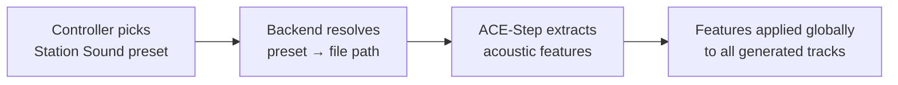
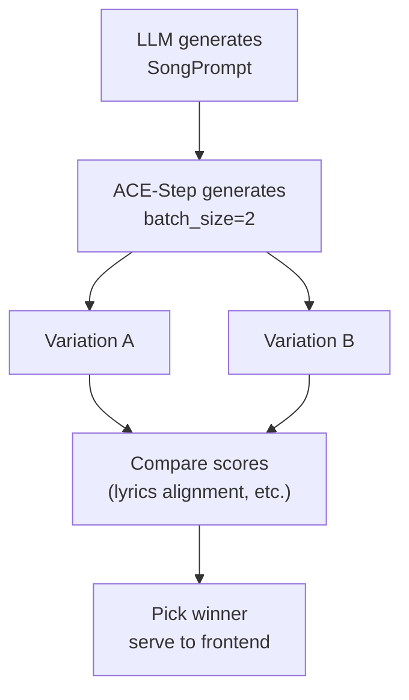
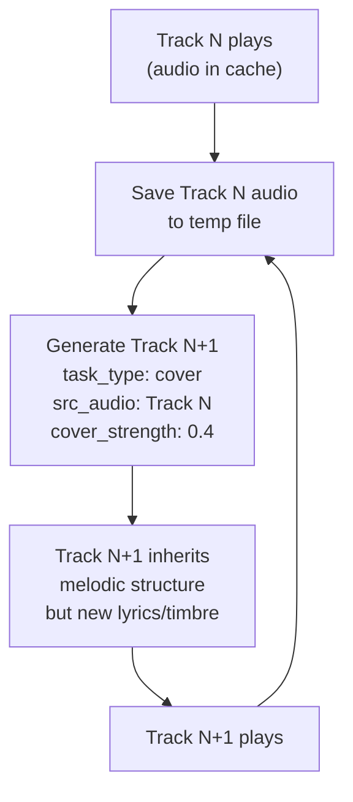

# ACE-Step Integration Enhancement Proposal

> **Date:** 2026-02-25
> **Status:** Draft — pending review
> **Reference:** [ACE-Step 1.5 Tutorial](https://github.com/ace-step/ACE-Step-1.5/blob/main/docs/en/Tutorial.md)

---

## Goal

Analyze the gap between the current ACE-Step integration and the full API capabilities, then propose concrete enhancements organized by effort and impact.

---

## Current Integration

### What we send to ACE-Step today

From `backend/acestep_client.py` (`submit_task` method):

| Parameter | Source | Value |
|---|---|---|
| `prompt` | LLM-generated `tags` field | Comma-separated style descriptors |
| `lyrics` | LLM-generated | `[verse]`, `[chorus]`, `[bridge]` markers |
| `bpm` | LLM-generated | 60–200 |
| `key_scale` | LLM-generated | e.g. "C Major", "Am" |
| `audio_duration` | `config.py` progressive ramp | 30–180 s depending on memory |
| `vocal_language` | User-selected | ISO 639-1 code or "unknown" |
| `thinking` | Fixed | `true` (always) |
| `batch_size` | Fixed | `1` (always) |
| `inference_steps` | Fixed | `8` (turbo) |
| `audio_format` | Fixed | `"mp3"` |
| `use_random_seed` | Fixed | `true` |

### What we do NOT use

These are all supported by the ACE-Step API but not currently passed:

| Parameter | What it does |
|---|---|
| `time_signature` | 4/4, 3/4, 6/8 — waltz, swing, standard time |
| `model` | DiT model variant: turbo, turbo-shift1, turbo-shift3, turbo-continuous, sft, base |
| `reference_audio` | Global acoustic/timbre control via an audio file |
| `src_audio` + `task_type: cover` | Melodic structure control from a reference track |
| `task_type: repaint` | Local modification of a time interval within a track |
| `audio_cover_strength` | 0.0–1.0 influence of reference/source audio |
| `use_format` | ACE-Step's own prompt formatting/enhancement |
| `use_cot_caption` | Chain-of-Thought caption rewriting by ACE-Step's internal LM |
| `sample_mode` + `sample_query` | Natural language description → auto-generate everything (bypasses our LLM) |
| `batch_size > 1` | Generate multiple variations per prompt |
| `seed` | Fixed seed for reproducible generation |
| `shift` | Timestep offset: larger = stronger semantics/structure, smaller = more detail |
| `inference_steps` (variable) | Quality vs speed tradeoff (4–16 for turbo models) |
| `infer_method` | `ode` (deterministic) vs `sde` (introduces randomness) |
| `lm_temperature` | ACE-Step internal LM creativity/randomness |
| `lm_cfg_scale` | ACE-Step internal LM prompt adherence |

---

## Proposed Enhancements

### Tier 1: Low-Effort, High-Value

These can be implemented with minimal changes — mostly adding fields to `SongPrompt`, updating the ACE-Step payload, and optionally exposing settings in the controller UI.

#### 1.1 Time Signature

**What:** Add `time_signature` to the LLM-generated `SongPrompt` and pass it to ACE-Step.

**Why:** Currently all songs default to 4/4. Waltz (3/4) and swing (6/8) are natural fits for Jazz, Folk, and Classical genres but never get generated.

**API param:** `time_signature` — values: `"2"`, `"3"`, `"4"`, `"6"` (for 2/4, 3/4, 4/4, 6/8)

**Changes:**
- `backend/models.py`: add `time_signature: str` to `SongPrompt`
- `backend/llm.py`: add time signature to LLM system prompt rules
- `backend/acestep_client.py`: include `time_signature` in payload
- Frontend: display time signature in track metadata (no new UI control needed — LLM picks it)

**Risk:** Low. LLM may not always pick musically appropriate time signatures, but ACE-Step treats it as guidance, not a hard constraint.

---

#### 1.2 Quality vs Speed Slider (Inference Steps)

**What:** Let the controller choose between faster generation (fewer steps) and higher quality (more steps).

**Why:** Currently hardcoded to 8 steps. On powerful machines, 12–16 steps may produce noticeably better audio. On constrained machines, 4 steps may be acceptable for faster iteration.

**API param:** `inference_steps` — range: 4–16 for turbo models

**Changes:**
- `backend/config.py`: add `DEFAULT_INFERENCE_STEPS` with env var override
- `backend/acestep_client.py`: accept `inference_steps` parameter
- `backend/radio.py`: pass session-level `inference_steps` to `generate_song()`
- Frontend `GenreSelector.tsx`: add a "Quality" toggle or slider (e.g., Fast / Balanced / High)
- WS `start` event: include `inferenceSteps` in data

**Risk:** Low. More steps = proportionally longer generation time. 16 steps ~ 2x the time of 8 steps.

---

#### 1.3 DiT Model Variant Selection

**What:** Let the controller (or auto-select per genre) choose which turbo variant to use.

**Why:** The four turbo variants have different sonic characteristics:
- `turbo` (default) — best balance of creativity and semantics
- `turbo-shift1` — richer details, weaker semantics
- `turbo-shift3` — clearer timbre, may sound "dry"
- `turbo-continuous` — most flexible, experimental

**API param:** `model` — e.g. `"acestep-v15-turbo"`, `"acestep-v15-turbo-shift1"`

**Changes:**
- `backend/config.py`: add model variant config with env var override
- `backend/acestep_client.py`: include `model` in payload
- Option A (simple): auto-map genre → variant (e.g., Lo-Fi → turbo-shift1 for warmth)
- Option B (advanced): expose as a controller UI setting

**Risk:** Low. All turbo variants use the same 8-step inference. The only risk is that some variants may need to be downloaded first (`uv run acestep-download --model ...`).

---

### Tier 2: Medium-Effort, High-Value

These require new data flows or UI concepts but stay within the existing `text2music` task type.

#### 2.1 Reference Audio Presets ("Station Sound")

**What:** A curated library of short reference audio clips that anchor the acoustic "feel" of the radio station — timbre, mixing style, production quality.

**Why:** This is one of ACE-Step's most powerful features. A 10-second reference clip can dramatically steer the generated audio's character — making everything sound like "lo-fi vinyl", "concert hall", "bedroom pop", or "80s synthwave" regardless of genre or lyrics.

**API param:** `reference_audio_path` (server-side file path) or multipart `ref_audio` upload

**Concept:**
- Ship 5–10 curated reference clips (10–30s each) as "station presets"
- Controller selects a station preset before starting (or "None" for default)
- Each preset is a `.mp3` file stored on the server alongside ACE-Step
- The path is passed in the payload; ACE-Step extracts acoustic features globally

**Changes:**
- New: `backend/presets/` directory with reference audio files
- `backend/acestep_client.py`: add `reference_audio_path` to payload
- `backend/radio.py`: store session-level `preset` and pass through
- Frontend `GenreSelector.tsx`: add a "Station Sound" preset picker
- WS `start` event: include `preset` in data

**Data flow:**

**Risk:** Medium. Reference audio can override genre intent if too strong. Need testing to find clips that "color" without "dominating". Memory impact is minimal (features are extracted once per generation).

---

#### 2.2 Batch Generation with Auto-Selection

**What:** Generate 2 (or more) variations per prompt and automatically select the best one using ACE-Step's scoring metrics.

**Why:** The Tutorial emphasizes that randomness is a core feature — "Large Batch + Automatic Scoring" is the recommended workflow. Even `batch_size=2` doubles the chance of a great track.

**API params:** `batch_size: 2`, then compare results using ACE-Step's DiT Lyrics Alignment Score

**Changes:**
- `backend/acestep_client.py`: `batch_size=2`, parse both results, select highest-scoring
- `backend/radio.py`: pass batch size as session config
- Frontend: optional — could show "Generated 2 variations, picked best" in activity log
- `config.py`: gate behind memory threshold (batch_size=2 needs ~2x Metal buffer)

**Data flow:**

**Risk:** Medium-high. Doubles generation time and memory usage. Should only be enabled on machines with ample memory (>= 48 GB). The scoring API needs verification — it may not be exposed via the REST API.

---

#### 2.3 "DJ Auto" Mode (Sample Mode)

**What:** An alternative generation mode where the user provides a simple natural language description (e.g., "a chill summer afternoon vibe") and ACE-Step's own LM handles everything — caption, lyrics, metadata.

**Why:** Bypasses our Ollama LLM entirely for a simpler, faster path. Good for users who don't want to think about genres/keywords. ACE-Step's sample mode is specifically designed for this.

**API params:** `sample_mode: true`, `sample_query: "a chill summer afternoon vibe"`

**Changes:**
- `backend/radio.py`: alternate generation path that skips `llm.generate_prompt()`
- `backend/acestep_client.py`: new `generate_song_auto()` method using sample_mode
- Frontend: add a "DJ Auto" toggle or alternative start flow with a text input
- WS `start` event: include `mode: "auto"` and `query: "..."` instead of genres/keywords

**Risk:** Medium. Sample mode quality depends entirely on ACE-Step's internal LM. We lose control over lyrics language, session history awareness, and variety management. Could be offered as an experimental/alternative mode alongside the current flow.

---

### Tier 3: High-Effort, Transformative

These introduce new ACE-Step task types and fundamentally change how the radio generates music.

#### 3.1 Cover Mode for Thematic Continuity

**What:** Use the previous track's audio as `src_audio` for the next one (`task_type: "cover"`), creating melodic and structural continuity between consecutive songs.

**Why:** Currently each song is generated independently — the radio feels like shuffled tracks. Cover mode would make the radio feel more like a continuous DJ mix where themes evolve organically.

**API params:** `task_type: "cover"`, `src_audio_path`, `audio_cover_strength: 0.3–0.7`

**Concept:**
- After each track finishes, save its audio to a temp file
- Use it as `src_audio` for the next generation with low cover strength (0.3–0.5)
- The next song inherits the melodic skeleton but gets new lyrics, timbre, and details
- Cover strength could decay over time (track 1 → 2: 0.5, track 2 → 3: 0.3, track 3 → 4: 0) to let the station "drift" naturally

**Data flow:**

**Changes:**
- `backend/acestep_client.py`: support `task_type`, `src_audio_path`, `audio_cover_strength`
- `backend/radio.py`: save previous track audio to disk, manage temp files, pass to next generation
- Frontend: could show "Inspired by previous track" in activity log
- New session option: "Continuous Mix" mode vs "Independent Tracks" mode

**Risk:** High. Cover mode makes each track dependent on the previous one — errors compound. Low cover_strength mitigates this but needs careful tuning. Temp file management adds complexity. Metal buffer usage may increase.

---

#### 3.2 Repaint-Based Transitions

**What:** Use ACE-Step's repaint mode to modify the last few seconds of the current track and/or the first few seconds of the next track, creating smoother transitions.

**Why:** Currently transitions are abrupt — one track ends and another begins. Repaint could create fade-outs, build-ups, or musical bridges.

**API params:** `task_type: "repaint"`, `src_audio_path`, `repainting_start`, `repainting_end`

**Concept:**
- After generating the next track, repaint its first 5–10 seconds using the ending of the current track as context
- Or: repaint the last 5–10 seconds of the current track to create a natural fade/transition

**Risk:** High. Adds an extra generation step per transition. Timing is tricky — the repaint must complete before the current track ends. May not work well with the pre-buffering model.

---

#### 3.3 "More Like This" via Seed Pinning

**What:** When the controller likes a track, they can "pin" its seed and generate the next track with the same seed but different lyrics/prompt — producing a variation with similar sonic character.

**Why:** Currently every track uses `use_random_seed: true`. If a particular generation sounds great, there's no way to explore that sonic neighborhood.

**API params:** `seed: <pinned_value>`, `use_random_seed: false`

**Changes:**
- `backend/radio.py`: store `result["seed_value"]` from each generation; accept a "pin seed" command
- `backend/acestep_client.py`: pass `seed` and `use_random_seed: false` when pinned
- Frontend: "More Like This" button on the player (controller only)
- WS: new `pin_seed` event

**Risk:** Low-medium. The implementation is simple but the UX design needs thought — how long does the pin last? One track? Until unpinned? Does it interact with cover mode?

---

## Summary Matrix

| # | Enhancement | Effort | Impact | Memory Cost | New API Params |
|---|---|---|---|---|---|
| 1.1 | Time Signature | Low | Medium | None | `time_signature` |
| 1.2 | Quality/Speed Slider | Low | Medium | None | `inference_steps` (variable) |
| 1.3 | DiT Model Variant | Low | Medium | None | `model` |
| 2.1 | Station Sound Presets | Medium | High | Minimal | `reference_audio_path` |
| 2.2 | Batch + Auto-Select | Medium | High | ~2x per gen | `batch_size` |
| 2.3 | DJ Auto Mode | Medium | Medium | None | `sample_mode`, `sample_query` |
| 3.1 | Cover Mode Continuity | High | High | Disk I/O | `task_type`, `src_audio_path`, `audio_cover_strength` |
| 3.2 | Repaint Transitions | High | Medium | Extra gen step | `task_type`, `repainting_start/end` |
| 3.3 | More Like This | Low-Med | Medium | None | `seed`, `use_random_seed` |

---

## Recommended Starting Point

Start with **Tier 1** (all three items) as they require minimal changes and unlock immediate variety. Then evaluate **2.1 (Station Sound Presets)** as the highest-impact Tier 2 item — reference audio is ACE-Step's strongest differentiator and maps naturally to the radio station concept.
