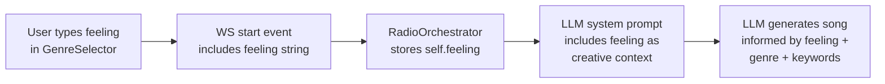

# Genre and Mood Expansion Proposal

> **Date:** 2026-02-25
> **Status:** Draft — pending review

---

## Current State

- **12 genres** in a flat 3-column grid: Rock, Pop, Jazz, Electronic, Hip-Hop, Classical, Lo-Fi, Ambient, R&B, Folk, Metal, Country
- **15 mood keywords** in a flat chip row: Energetic, Melancholic, Dreamy, Aggressive, Chill, Upbeat, Dark, Romantic, Ethereal, Groovy, Epic, Nostalgic, Minimal, Psychedelic, Cinematic
- No free-text input for user feelings

---

## 1. Expand Genres from 12 to 24

Add 12 new genres that ACE-Step handles well and that represent significant gaps in the current lineup. These are sourced from ACE-Step's documented 100+ genre support and the [Ambience AI prompting guide](https://www.ambienceai.com/tutorials/ace-step-music-prompting-guide).

### New genres to add

| Genre | Icon | Why | Subgenres |
|---|---|---|---|
| Blues | 🎺 | Foundational genre, strong training data | delta blues, Chicago blues, blues rock, electric blues, acoustic blues |
| Soul | 🎤 | Rich vocal tradition, distinct from R&B | classic soul, Northern soul, psychedelic soul, blue-eyed soul, modern soul |
| Reggae | 🌴 | Rhythmically unique, large global audience | roots reggae, dub, dancehall, lovers rock, ska-reggae |
| Latin | 💃 | Salsa, reggaeton, cumbia, bachata — massive global reach | reggaeton, salsa, cumbia, bachata, Latin pop |
| Afrobeats | 🥁 | Massive global genre, rapidly growing | Afro-pop, Afro-fusion, amapiano, highlife, Afro-house |
| Disco | 🪩 | Distinct from Electronic, dance-focused | nu-disco, Italo disco, space disco, boogie, disco funk |
| Punk | 🔥 | Currently only a Rock subgenre; distinct identity | hardcore punk, pop punk, post-punk, anarcho-punk, skate punk |
| Soundtrack | 🎬 | Cinematic / film score / game music | orchestral score, ambient score, electronic score, adventure theme, horror soundtrack |
| Synthwave | 🌆 | Popular retro style, buried under Electronic | retrowave, darksynth, outrun, dreamwave, vaporwave |
| Gospel | ⛪ | Spiritual, choir-driven, strong vocal presence | contemporary gospel, traditional gospel, gospel choir, gospel R&B, praise and worship |
| Ska | 🎺 | Upbeat, brass-driven, rhythmically distinct | two-tone ska, ska punk, traditional ska, rocksteady, third-wave ska |
| Bossa Nova | 🌙 | Currently a Jazz subgenre; deserves its own card | classic bossa nova, modern bossa, bossa jazz, tropical bossa, acoustic bossa |

### Updated genre list (24 total)

Existing (12): Rock, Pop, Jazz, Electronic, Hip-Hop, Classical, Lo-Fi, Ambient, R&B, Folk, Metal, Country

New (12): Blues, Soul, Reggae, Latin, Afrobeats, Disco, Punk, Soundtrack, Synthwave, Gospel, Ska, Bossa Nova

### UI consideration

24 genres = 8 rows of 3 columns. Two options:

- **Option A (simple):** Extend the grid as-is. 8 rows is still scrollable and scannable. No frontend component changes beyond data.
- **Option B (grouped):** Organize into collapsible categories (e.g., "Rock & Punk", "Electronic & Dance", "World & Latin"). More complex frontend change.

**Recommendation:** Option A for initial implementation. Revisit grouping if user testing shows the grid feels overwhelming.

### Backend data shape

No change — each genre still follows the existing shape:

```python
{"id": "blues", "label": "Blues", "icon": "🎺", "subgenres": ["delta blues", "Chicago blues", ...]}
```

---

## 2. Expand Moods from 15 to 29, Organized by Category

Expand from 15 flat keywords to 29, grouped into 4 categories. Categories help users who aren't sure what mood to pick find relevant options faster.

### Proposed categories and keywords

**Energy** (6)

| Keyword | New? |
|---|---|
| Energetic | Existing |
| Chill | Existing |
| Upbeat | Existing |
| Intense | New |
| Hypnotic | New |
| Laid-back | New |

**Emotion** (8)

| Keyword | New? |
|---|---|
| Melancholic | Existing |
| Romantic | Existing |
| Nostalgic | Existing |
| Joyful | New |
| Bittersweet | New |
| Hopeful | New |
| Tender | New |
| Rebellious | New |

**Atmosphere** (8)

| Keyword | New? |
|---|---|
| Dreamy | Existing |
| Dark | Existing |
| Ethereal | Existing |
| Cinematic | Existing |
| Mysterious | New |
| Haunting | New |
| Serene | New |
| Euphoric | New |

**Texture** (7)

| Keyword | New? |
|---|---|
| Minimal | Existing |
| Psychedelic | Existing |
| Groovy | Existing |
| Epic | Existing |
| Raw | New |
| Lush | New |
| Warm | New |

### Summary

- **Kept:** All 15 existing keywords (no removals)
- **Added:** 14 new keywords
- **Total:** 29 keywords in 4 categories

### Backend data shape change

Keywords gain a `category` field:

```python
# Before
{"id": "warm", "label": "Warm"}

# After
{"id": "warm", "label": "Warm", "category": "texture"}
```

### Frontend rendering change

Instead of one flat row of chips, render 4 labeled groups:

```
Energy
[Energetic] [Chill] [Upbeat] [Intense] [Hypnotic] [Laid-back]

Emotion
[Melancholic] [Romantic] [Nostalgic] [Joyful] [Bittersweet] [Hopeful] [Tender] [Rebellious]

Atmosphere
[Dreamy] [Dark] [Ethereal] [Cinematic] [Mysterious] [Haunting] [Serene] [Euphoric]

Texture
[Minimal] [Psychedelic] [Groovy] [Epic] [Raw] [Lush] [Warm]
```

Category headings use the existing `.selector__section-title` style (small, uppercase, muted). Multi-select behavior is unchanged — users can pick from any/all categories.

---

## 3. Free-Text "How Are You Feeling Today?" Field

A text input (max 200 characters) where the user can describe their current mood in natural language. This is **additive** to keyword selection — keywords provide quick structured anchors, the text field adds personal nuance.

### Examples

- "I just got promoted and I'm walking home in the rain feeling on top of the world"
- "Late night coding session, need focus"
- "Sunday morning coffee, lazy and content"
- "Missing someone far away"

### How it flows through the system



### LLM prompt injection

When the user provides a feeling, it is added to the LLM system prompt between the genre/keyword section and the rules section:

```
SELECTED GENRES: Jazz
SELECTED MOODS / KEYWORDS: Chill, Nostalgic

USER'S FEELING: "Late night coding session, need focus"
Use this feeling to inspire the song's mood, lyric themes, and musical choices.
Reflect the emotional tone in your lyrics and style tag selection.

RULES:
...
```

If the field is empty, this section is omitted entirely — no change to existing behavior.

### Frontend placement

The text input sits between the mood keywords section and the Start Radio button:

```
Choose your genre
[genre grid]

Set the mood (optional)
[keyword chips grouped by category]

How are you feeling today? (optional)
[____________________________] 0/200

[summary line]
[Start Radio]
```

Styled as a single-line text input with a subtle border matching the keyword chip aesthetic. Character counter (e.g., "142/200") shown at the right edge.

---

## Changes Per File

| File | Changes |
|---|---|
| `backend/genres.py` | Add 12 new genres with subgenres/icons; add 14 new keywords with `category` field on all 29 |
| `backend/llm.py` | Accept `feeling` parameter; inject into system prompt when non-empty |
| `backend/radio.py` | Store `self.feeling`; pass to `llm.generate_prompt()` |
| `backend/main.py` | Extract `feeling` from WS `start` event data |
| `backend/models.py` | Add `feeling: str = ""` to `RadioStartRequest` |
| `frontend/src/types.ts` | Add `category: string` to `Keyword` interface |
| `frontend/src/components/GenreSelector.tsx` | Render expanded genre grid; group mood chips by category; add feeling text input |
| `frontend/src/App.tsx` | Pass `feeling` string through `handleStart` callback |
| `frontend/src/hooks/useRadio.ts` | Include `feeling` in WS `start` event payload |
| `frontend/src/App.css` | Styles for mood category sub-headings; feeling text input and character counter |

---

## Migration Notes

- **No breaking changes.** All additions are backward-compatible.
- Existing keyword IDs are preserved. The `category` field is new but the frontend can gracefully handle keywords without it (fall back to a single group).
- The `feeling` field defaults to `""` — existing WS messages without it work unchanged.
- `GET /api/genres` response grows but the shape stays the same (genres array, keywords array, languages array).
